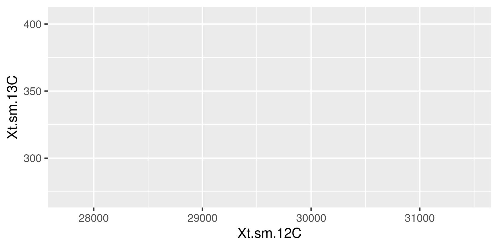
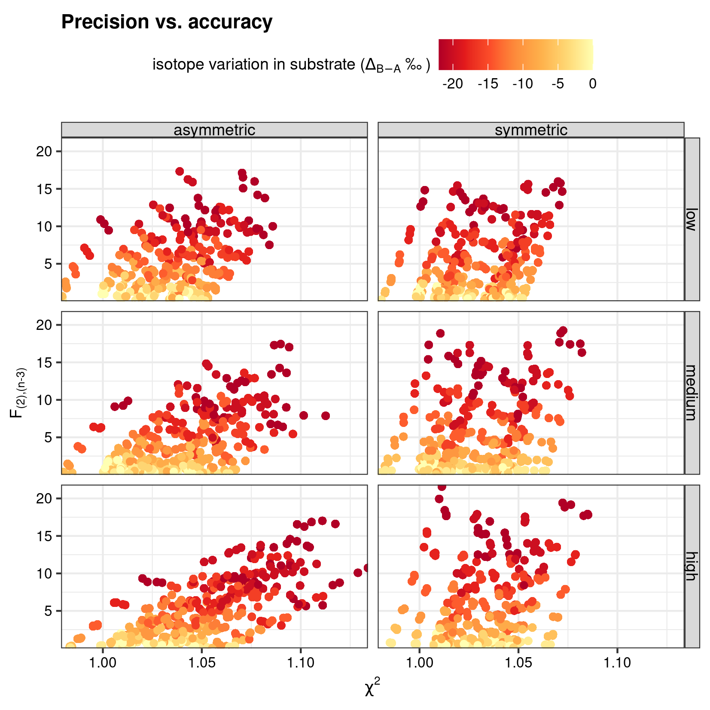
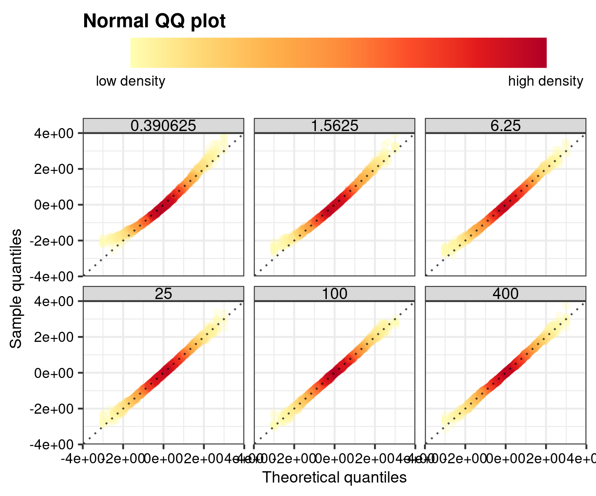
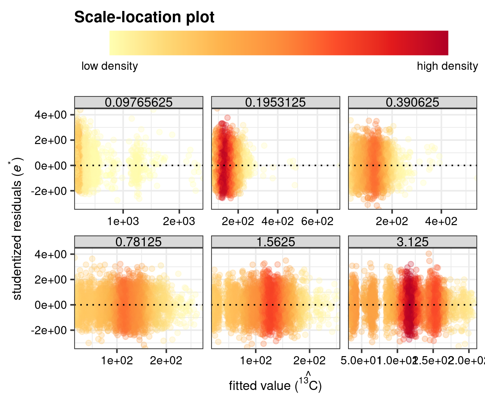
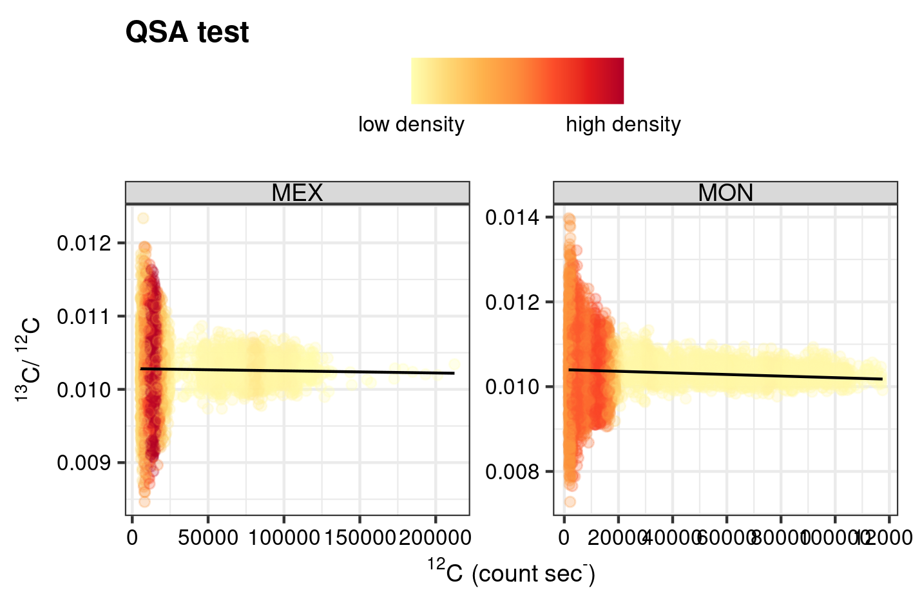

\beginsupplement 

# Supplementary Methods and Data

## Software for data treatment, statistics, and visualization

Data treatment, statistics and visualization was performed in the R environment [@rversion]. The R package `point` [@point] is especially designed for ion count statistics. This R package was extended to include the here-discussed diagnostic tools and inference tests for intra- and inter-analysis isotopic variability (`diag_R()`, see Section \@ref(sec:point)). Rmarkdown files are used for the manuscript, supplementary information and the documentation of data reduction and simulation protocols `knitr` [@knitr; @knitr2014 ; @knitr2015], `rmarkdown` [@rmarkdown; @rmarkdown2018; @rmarkdown2020], `bookdown` [@bookdown; @bookdown2016], and `rticles` [@rticles] with further aid from the packages and `kableExtra` [@kableExtra] for tables. These documents further rely on the packages; `ggplot2` [@ggplot2] and `dplyr` [@dplyr] for graphs and data transformation and `fs` [@fs] for convenient declaration of the relative path to a file.

The R package `pointapply` was especially designed to reproduce all aspects of this paper, where the function `render_paper()` can be used to assemble this paper from source. The raw and processed data are stored in a Zenodo repository `pointdata` and can be downloaded with the function `download_point()`. Extended documentation in the form of vignettes (call `vignette(package = "pointapply")` to list all vignettes) can be consulted to give more in-depth information about the code to generate, process and visualize the ion count data, as discussed in this paper (Supplementary Table \@ref(tab:repo)). 


```{r repo}
# table of repos
repo <- tibble::tibble(
  name = c("point", "pointapply","pointdata"),
  repository = c("Github (CRAN)", "Github", "Zenodo"),
  description = c(
    "intra- and inter-analysis isotope variability tests", 
    "reproduction paper", 
    "data"
    ),
  DOI = c(
    "\\href{https://doi.org/10.5281/zenodo.4633104}{10.5281/zenodo.4633104}",
    "\\href{https://doi.org/10.5281/zenodo.4748376}{10.5281/zenodo.4748376}",
    "\\href{https://doi.org/10.5281/zenodo.4748667}{10.5281/zenodo.4748667}"
    )
)
# print
kableExtra::kable(
  repo,
  booktabs = TRUE,
  escape = FALSE,
  caption = "Software and repositories to reproduce this study"
  ) %>%
# styling  
  kableExtra::kable_styling(latex_options = "HOLD_position")
```


## Synthetic data {#sec:simulation}

Synthetic data was generated to evaluate the performance of the intra- and inter-analysis isotope variability test under a range of conditions with standard model classification metrics (see Section \@ref(sec:performance)). These conditions are chosen to closely mimic the ranges as expected for a carbonate substrate with, and without, internal ^13^C/^12^C heterogeneity (following the example of a carbonate-based RM of the main text and Figure \@ref(fig:sketch)). The protocol to simulate ion count data is further designed to approximate standard analytical procedures for carbonate ^13^C/^12^C analyses with a precision of `r permille(1)` ($\epsilon_{\bar{R}}$; Supplementary Equation \@ref(eq:se)), thereby considering varying degrees of excess ionization and the fundamental imprecision associated with secondary ion emission (see Section \@ref(sec:theory)). 

**Fundamental imprecision**: The random nature of secondary ions emitted from an analyte during sputtering with SIMS can be described by Poisson statistics (where the uncertainty is a function of the total count number $N$, see Supplementary Equation \@ref(eq:sepois)), and is superimposed on systematic fluctuations in the ionization efficiency (parametrised as "excess ionization", see Section \@ref(sec:theory)) which is mirrored among both isotopes of the same element [@Fitzsimons2000a]. The fundamental imprecision described by Poisson statistics can therefore be used to derive parameter settings to simulate prescribed isotope sampling conditions. Following these considerations, a typical SIMS isotope analysis was simulated by considering a total of ~`r sprintf("%0.2e", 1e6)` counts ($N$) for the rare isotope species $b$ (^13^C) to attain a theoretical precision of `r permille(1)` [@Fitzsimons2000a], and around `r sprintf("%0.2e", 1e6/filter(point::reference_R, isotope == "13C" & reference == "VPDB")$value)` for isotope species $a$ (^12^C), where the latter value is derived by conversion with Equation \@ref(eq:linmodR) and the isotopic abundance of ^13^C of the Vienna Peedee Belemnite (VPDB)[@Coplen2006]. Although the theoretical precision of the analysis remains unchanged regardless the number ($n$) of measurements [@Fitzsimons2000a], the intra- and inter-analysis isotope variability test are dependent on how one defines $n$, and thus the average counts per measurement ($\bar{N}$), as with reduced $\bar{N}$, the Poisson distribution will not approach a normal distribution. This could have an affect on the regression-based diagnostics and inferences (Eq. \@ref(eq:linmodR)) as well as the descriptive statics, where central tendencies and variance would be underlain by a skewed distribution. To prevent this, and to most realistically approach actual analytical conditions, mean ion emission rates for ^13^C $X^{a}$ are set to $\sim$`r SI(333, c("count", "per", "second"), "int")`. The function `simu_R()` of the R package *point* [@point] was used to simulate ion count data for ^12^C and ^13^C, which adds the fundamental imprecision of ion count data by random number generation following a Poisson distribution (the previous described aspects are the default setting of `simu_R()`). Besides the function capability to simulate the desired isotope system relative to a reference scale (VPDB-scale), it allows tuning of these default parameter settings. This aspect was exploited to set-up sensitivity experiments to gauge the performance of isotope heterogeneity detection (Section \@ref(sec:RegDia)). 

**Excess ionization**: The argument `.sys` of the function `simu_R()` allows simulation of correlated variation among both isotopes in order to mimic the efficiency of secondary ion extraction, which is an aspect of charge build-up and sputter-pit depth and -geometry development with the on-going analysis [@Fitzsimons2000a]. The variability of the simulated ionization efficiency was quantified as the difference between the descriptive relative standard deviation ($\epsilon_{X^{a}}$) and the theoretical standard deviation ($\hat{\epsilon}_{X^{a}}$) of the common isotope (see Fig. \@ref(fig:ionization) and Section \@ref(sec:theory)). The simulated ion yield efficiency was then tested over a total range of $120$%, which translated to an excess ionization range of up to $34$%. This excess ionization was constrained based on experience gained when measuring carbonate ^13^C/^12^C with a Cameca NanoSIMS 50L (Utrecht University, Netherlands). Besides variable $R$, fluctuations in ionization efficiency are included in the simulated data, because the regression-based diagnostics and hypothesis tests would be sensitive to variance of the independent variable $X^{a}$ (i.e., ^12^C).  

**Isotopic heterogeneity**: Lastly, isotopic heterogeneity can be simulated with the function `simu_R()` by changing the argument `.type`. In case of intra-analysis isotope variability, two end-members of isotopic heterogeneity were envisioned. In the first situation, only a small subset of the $n$-measurements (component $B$) deviates from a larger fraction, i.e., the predominant component $A$ (Fig. \@ref(fig:concept)). Furthermore, the small deviating component is presumed to fall in the upper (or lower) range of observed count rates, simulating the effect of a change in the ionized matrix as well as isotope composition [e.g., @Eiler1997]. This scenario, referred to as asymmetric isotope variation, would approximate a situation in which the primary ion beams cuts through an organic inclusion with depth within a predominant carbonate matrix, and thus both the matrix and isotopic composition deviate between components $A$ and $B$ (following the carbonate-based RM example of Fig. \@ref(fig:sketch)). This scenario can be approximated with the function `simu_R()` by setting argument `.type` to `"asymmetric"`.

\begin{equation}
  \begin{cases}
     X^{b} = R^{A}X^{a}, & \text{where} \quad R^{A} \neq  R^{B} \\
     X^{b} = R^{B}X^{a}, & \text{where} \quad R^{B} \neq  R^{A}  (\#eq:asymR) \\
   \end{cases}
\end{equation}

In a second scenario of symmetric intra-analysis isotope variation, a simulated gradient in $R$ traverses the whole of the analysed substrate (represented by the $n$-series of measurements). In this second end-member, with perfectly balanced offsets in $R_i$ with distance from $\bar{R}$ (Supplementary Fig. \@ref(fig:concept)), a linear gradient of $R$ is substituted in Equation \@ref(eq:linmodR), obtaining a second order polynomial.

\begin{equation}
  X^{b} = X^{a} \left( R_{0} + \beta_{R} X^{a} \right) (\#eq:symR)
\end{equation}

Here, $\beta_{R}$ and $R_{0}$ represent the slope coefficient and intercept of the linear gradient in $R$. Isotopic gradients within minerals are expected as a consequence of relative importance of diffusion and precipitation/crystallization rates as well differences in temperature regimes in both near-surface sedimentary and deep magmatic systems [@Berner1980; @Valley1991]. This scenario can be simulated with the function `simu_R()` by setting argument `.type` to `"symmetric"`.


```{r concept, fig.cap="Conceptual graphs for intra-analysis $R$ variation with the mean $R$ ($\\bar{R}$) and simulated ratios $R_{i}$ values for three scenarios; the ideal linear model (Eq. \\ref{eq:linmodR}), asymmetric (Eq. \\ref{eq:asymR}) and symmetric isotope variation (Eq. \\ref{eq:symR})."}

```


The range of both types of intra-analysis isotopic heterogeneity is selected to mimic the influence of organic carbon and/or authigenic carbonate formed in the presence of respired carbon [@Hayes1999; @Schrag2013]. These ranges where selected based on literature $\delta$ values relative to VPDB (see Eq. \@ref(eq:delta)), where conservative end-member values can range up to `r permille(-22, sign = TRUE)` (or even) lower $\delta$^13^C when compared to seawater derived carbonate, which typically fluctuates around `r permille(0)` on the VPDB-scale [@Hayes1999; @Schrag2013]. These parameter settings are introduced to the function by setting the arguments `.ion1 = "13C"`, `.ion2 = "12C"`, and `.reference = "VPDB"` to define the isotope system and reference scale, and argument `.devR` to set the desired isotopic offset. This procedure was repeated $15$ times (argument `.rep` of `simu_R()`), after which, the outlier detection methods; $\sigma_{R}$-rejection and Cook's D (with the function `diag_R()`) were used to analyse the data (see main text for details), and thereby forming the basis for the sensitivity test, which are summarised in the heatmap (Fig. \@ref(fig:effect)).

The same range of ion yield efficiency (as for intra-analysis isotope variability) was used to test the sensitivity of the inter-analysis isotope variability test (main text), but now the argument `.type` of `simu_R()`for intra-analysis isotope variability was set to `"ideal"`, in order to produce isotopically homogeneous analysis. Instead, the starting value  $R_{\text{input}}$ (where $R_{\text{input}} \approx \bar{R}$) was varied over a range of `r permille(-11, sign = TRUE)` to `r permille(0)` (also on the VPDB-sale) for one out of 10 analysis.  This mimics the influence of one anomalous analysis out of an $m$-series of analyses and forms the basis to gauge the sensitivity of the inter-analysis isotope variability test (outlined in the main text) and summarised in the heatmap (Fig. \@ref(fig:heatmap2)). 

The R code for the data simulation, the specific test for intra- and inter-analysis isotope variability, and visualization can be found in the `pointapply` vignettes *simulation* (`vignette("simulation", package = "pointapply)`) and *performance* (`vignette("performance", package = "pointapply)`), respectively.  


## Real data {#sec:realdat}

A Cameca NanoSIMS 50L (Utrecht University, Netherlands) has been used to produce "real" data on the selected MON and MEX materials with a prime focus on the ^13^C/^12^C composition. The spatial resolution of the Cameca NanoSIMS 50L has been shown to be able to successfully target sulfide and carbonate minerals on areas of ~`r SI(5, c("micro", "metre"))` by `r SI(5, c("micro", "metre"))`, while yielding a precision of around `r permille(1)` for e.g., ^34^S/^32^S and ^18^O/^16^O [@Slodzian2004; @Fike2008; @Wei2015]. Instead of the commonly applied point-sourced high precision mode for isotope analysis, an ion mapping study was deemed more conductive for model validation in this study. In this mode, spots are rastered over a grid of `r SI(256, "pixel", "in")` by `r SI(256, "pixel", "in")` with a resolution of `r SI(0.15625, c("micro", "metre"))` and a dwell time of `r SI(1, c("milli","second"))` (current: `r SI(2, c("milli","ampere"))`, energy: `r SI(16, c("kilo","electronvolt"))`), counts were then accumulated over $400$ frames, excavating material from successively deeper layers. The machine has 8 electron multiplier (EM) ion counting devices, and can, when strategically chosen, accommodate 8 masses (e.g., isotope species or polyatomic species). Besides close monitoring of beam alignment and EM ageing, systematic biases caused by detector deadtime and yield are corrected for, whereas the effects of Quasi Simulations Arrival (QSA) are evaluated in Supplementary Section \@ref(sec:QSA). This non-conventional mode for isotopic analysis was chosen as it provides high-resolution raster images of auxiliary ion distributions (`r sapply(c("40Ca-16O", "12C-14N"), point::ion_labeller, "latex")`) across the various planes of the generated 3-dimensional array. This additional source of information can be used to detect allochthonous carbon sources, such as organic inclusions (proxied by e.g., `r point::R_labeller("12C", "40Ca-16O")` and `r point::R_labeller("12C-14N", "12C")`). In addition, it enables cross-validation of the intra-analysis isotope variability at the $<$`r SI(1, c("micro", "metre"))` with inter-analysis isotope variability at the $>$`r SI(10, c("micro", "metre"))` with the here-designed methods. Finally, this mode of SIMS isotope analysis helps suppress within-run drift of $R$, which is a frequently observed phenomenon especially among studies encompassing a series of analysis (i.e., a transect of sputter pits) collected over multiple hours [@Fitzsimons2000a; @Ramsey2018].

The machine output was generated by the default Cameca^TM^ software. The algorithms of the Matlab-based software Look\@NanoSIMS [@Polerecky2012] were then used for alignment and accumulation of the pixels along the measured frames with depth. The systematic biases for dead-time and electron multiplier yield are also corrected with this software package. 

The matlab generated files were loaded in the R environment with the function `read_mat()` (of the R package: `readmat` [@readmat]). A re-sampling grid was used to rasterize the obtained 3-dimensional arrays into equal-sized squares for ^13^C/^12^C, and this procedure was repeated for different grid-cell sizes, constituting squares with a side that measures `r sapply(c(0.63, 1.25, 2.50, 5.00, 10.00), sprintf, fmt = "%.2f")` or `r SI(20, c("micro", "metre"))` (see Supplementary Fig. \@ref(fig:gridsketch)). In turn, the array was flattened into a long format data frame with aid of the R package for further data aggregation. For aggregation over the width and height, the maximum number of frames was taken as the second dimension. In addition to $R$ analyses, pixel-by-pixel ion maps for `r point::R_labeller("12C", "40Ca-16O")` and  `r point::R_labeller("12C-14N", "12C")` were generated by aggregation over depth, width and height. 


```{r gridsketch, fig.cap=paste0("Layout and numbering of the ", SI(10, c("micro", "metre")), "$\\times$", SI(10, c("micro", "metre")), " grid-cell sizes of Figs \\ref{fig:MON} and \\ref{fig:MEX}, and Supplementary Fig. \\ref{fig:nitro1}.")}
knitr::include_graphics("figures/grid_sketch.png")
```


The minimum appropriate grid-cell size was selected from this range, where cumulative counts approximate a normal distribution and heterogeneous distribution of residuals (Supplementary Section \@ref(sec:validation)). Pooling of studentized residuals (Eq \ref{eq:studres}), based on fitting the "ideal" linear model (Eq. \@ref(eq:linmodR)), was used check the distribution of the underlying data structure [@Zuur2008]. Normal Quantile-Quantile (QQ) plots (Supplementary Fig. \@ref(fig:QQdens)), scale location plots  (Supplementary Fig. \@ref(fig:CVdens)) and Anderson Darling tests of normality  (Supplementary Fig. \@ref(fig:hyp)) suggest that a grid-cell size of above `r SI(5, c("micro", "metre"))` by `r SI(5, c("micro", "metre"))` is most appropriate for the regression-based diagnostics (see Supplementary Section \@ref(sec:validation) for more information on the grid-cell selection). Diagnostic tools for linear regression, such as, normality, constant variance and independence of residuals are contained in the `point` R package in the diagnostic function `diag_R()`. This functionality can be accessed by changing the default argument `.method` to e.g., `"QQ"` for a normality check [see Section \@ref(sec:point), Schobben, in prep and @point for details].


```
# Load point with library.
library(point)
# Normality test
diag_R(.IC = <DATA>, .ion1 = "13C", .ion2 = "12C", <GROUPS>, .method = "QQ")
```

Grid-cell sizes of `r SI(10, c("micro", "metre"))` by `r SI(10, c("micro", "metre"))` yielded a precision for ^13^C/^12^C that ranges between `r stringr::str_c(sapply(range(stat_R_64_all$RSeM_R_Xt.pr), permille), collapse = "--")` ($\epsilon_{\bar{R}}$, see Supplementary Eq. \@ref(eq:se)), and thereby most closely approximates the standard analytical conditions (high-precision SIMS isotope analysis), while still preserving spatial resolution. The analytical precision is, however, somewhat less than usually aimed for, but the current study aims at providing methods that improve the accuracy of SIMS isotope measurements based on the underlying data structure of the ion counts, and not the precision (see Supplementary Section \@ref(sec:precision) and Supplementary Table \@ref(tab:precision) for details on the precision).

The data and R code for loading the matlab file and consecutive transformation and aggregation of the ion arrays as well as visualization can be found in the  `pointapply` vignettes *data* (`vignette("data", package = "pointapply)`) and *raster* (`vignette("raster", package = "pointapply)`).  


# Supplementary Results and Discussion

## Precision of isotope analysis {#sec:precision}

Precision is a fundamental aspect of SIMS isotope analysis, as it dictates the degree to which, for example, a set of analyses along a transect on a mineral surface can be compared to each other. If this inter-analysis isotopic variation is close to the analytical uncertainty, then the information extracted from such a study becomes less meaningful. This is an additional factor that can interfere with RM value assignment, besides the trueness of a value, as targeted in this study, which essentially evaluates whether the mean value is representative of the underlying data. Nonetheless, skewness of the underlying data caused by intra- and/or inter-analysis isotopic variation of the substrate could also influence the precision of a single analysis or an $m$-series of analysis. 

The fundamental imprecision, which is likely governed by a quantum effect linked to ionization during sputtering [@Schroeer1973; @Shimizu1982], can be approximated by count (Poisson) statistics [@Fitzsimons2000a]. This uncertainty of a typical SIMS ion count data can be on the order of $10$s of `r permille(NULL)` and can be described by the standard deviation of a sample [see e.g., @Fitzsimons2000a].

\begin{equation}
s_{X^a} = \sqrt{\sum_{i=1}^{n}  \frac{(X_{i}^a-\bar{X}^a)^2}{n-1}} (\#eq:sd)
\end{equation}

This large standard deviation of a typical SIMS isotope analysis, is often accommodated by the production of a large number of counts ($N\geq10^6$ for the rare isotope, e.g., ^13^C), which narrows the precision of light element isotope ratios to within `r permille(1)`. This can be expressed mathematically by the error of the mean, which becomes smaller with the square root of the number of observations.

\begin{equation}
s_{\bar{X}^a} = \frac{s_{X^a}}{\sqrt{n}} (\#eq:se)
\end{equation}

The formulation provided here, expressed as the count rate of a single ion, describes a probability interval of including the population mean. The $s_{X^a}$ and $s_{\bar{X}^a}$ can also expressed as a relative terms in `r permille(NULL, sign = TRUE)` by division through the mean ($\epsilon_{X} = (s_{X}/\bar{X}) \times 10^3$ and $\epsilon_{\bar{X}} = (s_{\bar{X}}/\bar{X}) \times 10^3$). In addition, the total counts per measurement $\bar{N}$ for species $a$ can be used to predict the standard deviation and maximum attainable precision under ideal circumstances (i.e., only affected by the fundamental imprecision, as described before; Section \@ref(sec:simulation)).

\begin{equation}
\hat{s}_{N^a} = \sqrt{\bar{N}^a}  \qquad \text{where} \qquad \bar{N}^a = \frac{1}{n}\sum_{i=1}^{n}N_i^a (\#eq:stdpois)
\end{equation}

\begin{equation}
  \hat{s}_{\bar{N}^a} = \sqrt{\left( \frac{ \bar{N}^a}{n}\right)} (\#eq:sepois)
\end{equation}

These predicted metrics for variance and precision can also be re-casted in relative `r permille(NULL)`-terms by division through the mean ($\hat{\epsilon}_{N} = (\hat{s}_{N}/\bar{N}) \times 10^3$ and $\hat{\epsilon}_{\bar{N}} = (\hat{s}_{\bar{N}}/\bar{N}) \times 10^3$). In addition, all these equations can be reformulated for isotopes ratios (ratios of means; Eq. \@ref(eq:estR)) with Taylor series expansion [see @Fitzsimons2000a; @point for detailed derivations]. A reduced $\chi^2$ test is, in turn, commonly applied to estimate how well the conditions during the measurement approximate the theoretical optimum, where values close to $1$ suggest good agreement, but higher values might indicate analyte heterogeneity [@Kilburn2015a].

\begin{equation}
\chi^2 = \left( \frac{s_{\bar{R}}} {\hat{s}_{\bar{R}}} \right)^2 (\#eq:chi2)
\end{equation}

The $\chi^2$ test statistic for ^13^C/^12^C analysis from the `r SI(10, c("micro", "metre"))`$\times$`r SI(10, c("micro", "metre"))` grid-cell sizes seems to indicate near ideal circumstances. This cast doubt on the often quoted mantra that chemical heterogeneity should have a noticeable effect on the precision of a SIMS isotope analysis [@Fitzsimons2000a]. A comparison of $\chi^2$ and $F$ test statistic for internal $R$ variability highlights that even deviations in the upper-end of the sensitivity test (`r permille(-20, sign = TRUE)`) cause negligible deviation from unity in $\chi^2$ (Supplementary Fig \@ref(fig:accuracy)). The precision was obtained with the `point` function `stat_R()` (see Schobben, in prep, the documentation of @point for extended details on this function and the `pointapply` vignette *accuracy* (`vignette("accuracy", package = "pointapply)` for exact reproduction of this section)). 

(ref:foot3) \@ref(fig:gridsketch)


```{r precision}
# footnote
ft <- paste0("See Supplementary Fig. ", "(ref:foot3)", " for layout and numbering of grid-cells.")
# table of precision stats
point::stat_R(map_sum_grid_64_all, "13C", "12C", sample.nm, 
              dim_name.nm,grid.nm, .stat=c("M", "RSeM", "chi2"), 
              .label = "latex") %>% 
  dplyr::rename(`analyte` = "sample.nm", `dimension` = "dim_name.nm", 
         `grid-cell*` = "grid.nm") %>% 
  dplyr::select(-ratio.nm) %>% 
# print  
  kableExtra::kable(
    booktabs = TRUE,  
    escape = FALSE,
    digits = c(1, 1, 1, 4, 1, 1),
    caption = 
      paste0(
        "Internal precision of $^{13}$C/$^{12}$C analysis on a $10.00\\times$", 
        SI(10, c("micro", "metre")), 
        "-grid"
        )
    ) %>% 
  kableExtra::footnote(symbol =  ft,  threeparttable = TRUE, escape  = FALSE)
```


```{r accuracy, fig.cap="Comparison of F statistic for intra-analysis isotopic variation with $\\chi^2$ test statistic for precision of the simulated data (see Section \\ref{sec:intra}). The bins; low, medium and high stand for excess ionization ($\\hat{\\epsilon}_{X^{a}} - \\epsilon_{X^{a}}$) of $5-15$\\%, $15-25$\\%, $25-35$\\%."}

```


## Validation of regression assumptions {#sec:validation}

The validity of inter- and intra-analysis isotope models is verified for the nanoSIMS generated data by an assessment of the implicit assumptions of the linear regression model (Eq. \@ref(eq:linmodR)); normality, homogeneity and independence of residuals. Furthermore, the validation of the regression assumptions aids selection of the appropriate grid-cell size as mentioned in Supplementary Section \@ref(sec:realdat)). These assumptions are tested on the studentized residuals $\hat{e}_i^*$ after fitting the "ideal" linear model (see Section \@ref(sec:RegDia) and Eq. \@ref(eq:studres) for derivations of the equations), and reflect upon the underlying bivariate data structure [@Zuur2008]. A visual examination of the normality of pooled $\hat{e}_i^*$ for the different grid-cell sizes can be achieved by means of a Quantile-Quantile comparison plot (*QQ normality plot*; Fig. \@ref(fig:QQdens)), where the empirical sample distribution is compared with a theoretical normal distribution, providing a means to distinguish $\hat{e}_i^*$ that deviate significantly from the normal assumption. The differences between the empirical and theoretical quantiles was also be formalized in an hypothesis test (*Anderson-Darling* hypothesis test). Based on an overview on the frequency of rejection of the $H0$ of normality, there seems to be a bias towards skewed distribution for grid-cell sizes smaller than `r SI(5, c("micro", "metre"))`, as expected based on count statistics, where $\bar{N} < 100$, seem to be detrimental to the assumptions of the "ideal" linear model (\@ref(fig:hyp)). One can further deduce from Figure \@ref(fig:CVdens), that the variance centrers around zero regardless of the grid-cell size. This can be further confirmed by a two-sided one-sample *Student's t* hypothesis test on the studentized result with  $H_0$: $\mu_0 = 0$, and  $Ha$: $\mu_0 \neq 0$.


```{r QQdens, fig.cap="Normal Quantile-Quantile plot for aggregated studentized resiudals ($\\hat{e}_i^*$) for the different grid-cell sizes."}

```


The *scale location plot* (Fig. \@ref(fig:CVdens)) of $\hat{e}_i^*$, can also be used as a convenient way to check the assumption of constant variance and the existence of outliers, where values that deviate more than $3.5$ from zero are usually considered outliers. Patterns in the homogeneity of variance can indicate whether the linear model suffers from systematic variations in the residuals that are dependent on the fitted variable ($\hat{X}^b$) (heteroscedasticity); possibly compromising the estimates for the model's coefficient. The hypothesis test known as the *Breusch-Pagan* hypothesis test fits a linear model to the residuals in order to make inference about heteroscedasticity. A summary overview suggest that there is no strong reason to reject the $H_0$ of homoscedasticity, and the assumption of constant variance seems to hold for all grid-cell sizes (Supplementary Fig. \@ref(fig:hyp)).  However, a visual inspection of Supplementary Fig. \@ref(fig:CVdens) seems to indicate a disproportionate number of residuals fall outside of the $3.5$ window at the lower end of ^13^C count rates for grid-cell size smaller than `r SI(5, c("micro", "metre"))`. This might again be a valid concern for the application of smaller than `r SI(5, c("micro", "metre"))` grid-cell sizes. 


```{r CVdens, fig.cap="Scale-location plots for different grid-cell sizes.  Depicting the systematic relationships between $\\hat{e}_i^*$ and the independent value $^{13}$C (Heteroscedasticity) or the homogeneity of variance (Homoscedasticity)."}

```


Lastly, count data, from one measurement to another, should represent independent distributions, where machine-specific conditions (fluctuations in the electronics, resonance or interference by magnetic fields) could be envisioned to cause dependence among sequential measurements, this can be formulated as the strength of the correlation of consecutive measurements (or autocorrelation). The *Ljung-Box* hypothesis test employs a timeseries without autocorrelation (or "white noise") as the $H_0$ to test against a sampled timeseries autocorrelation strength. The overview graph (\@ref(fig:hyp)), for the frequency of the failure to reject $H_0$ of white noise, supports independence of measurement distributions. The R code for the validation fo regression assumptions can be found in the `pointapply` vignette *regression* (`vignette("regression", package = "pointapply)`). 


```{r hyp, fig.cap="Overview of hypothesis test for the validation of the regression assumptions, based on studentized residuals, and including; Anderson-Darling tests for normality, Breusch-Pagan tests for homogeneity, two-sided one sample Student's t test with a $\\mu=0$ for the residuals, and Ljung-Box test for autocorrelation. In each panel, the frequency of the failure to reject the $H_0$ is depicted for the different grid-cell sizes. The average count per grid-cell size is given on the secondary x-axis."}
knitr::include_graphics("figures/bar_over_class.png")
```


## Quasi Simultaneous Arrival {#sec:QSA}

Measuring under high ionisation efficiencies with an electron multiplier (EM) can lead to an artifact understood as the more-or-less (quasi) simultaneous arrival (QSA) of an incident ion at the detection device. Differentiation of the two secondary ions is thus not possible, and the ions are therefore counted as $1$ detection event by the machine. In the case of isotope systems this could theoretically lead to undersampling of the common isotope [@Slodzian2004]. As opposed to e.g., the deadtime correction (related to paralysis of the EM in a specific time-window), a simple solution is not straightforward, and, on top of that, the artifact can also lead to fluctuations of $R$ within a single analysis. Given that ionization efficiency fluctuating are a common feature of routine SIMS measurements (as is underlined in this study), and likely relates to sputter pit geometry development and charge build-up [@Fitzsimons2000a], this could impact the precision as well the accuracy of an isotope analysis. One could argue that it would not matter for the validity of the here-developed tests whether detected isotope variation is related to QSA, or to the underlying data structure emanating from the isotope composition of the analyte. However, it remains a fruitful endeavor to constrain whether e.g., a typical calcite mineral or carbonate rock exhibits isotopic variation at a nanoSIMS spatial resolution. More so, as correct value assignment is of high importance for RM development, which, in turn, leads to smaller errors when constraining the isotopic composition of analytes at microscopic scales. To pursue this effort, an approximation of QSA can be undertaken by fitting a linear model to ^12^C count rates as a predictor, and ^13^C/^12^C as the independent variable. By doing so, the slope of the fitted linear model trends towards lower ^13^C/^12^C with a higher ionization efficiency (Supplementary Fig. \@ref(fig:QSA)), where the coefficients are highly significant ($p<0.001$) in both instances, based on conventional t-test statistics. Paradoxically, if the trend would reflect upon the underlying relation between ionization efficiency of the common isotope, then it cannot be reconciled with QSA and undersampling of ^12^C at higher levels of ionization efficiency. In the absence of other documented machine-related isotope fractionations, and the premise that ionization efficiency differences for isotopes of the same element are cancelled out upon division [@Fitzsimons2000a], then the linked relation between matrix and ionization yield [@Slodzian1980] most likely translates back to the analyte, which based on our analysis also exhibits correlated difference in ^13^C/^12^C. What this intra- and inter-analysis isotopic heterogeneity encompasses is not entirely clear, but in the case of the crystalline MON, these correlative features most compellingly relate to compositional modifications [@Eiler1997]. These  compositional differences could also lead to variations in the IMF, if that would be the case the gradient might not be directly transferable to the analyte. The latter implications remain to be tested in future studies, and is also insignificant in terms of the validity of the test statistics presented in this study. The inter-analysis isotopic heterogeneity of the sedimentary carbonate MEX must probably be sought in the dispersion of different minerals and phases, but as variance of $R$ is close to the predicted precision, it is of limited significance, rendering the sample effectively homogeneous in terms of the technical limitations of nanoSIMS. The QSA test was performed with the `point` function `QSA_test()` [see the documentation of @point for extended details on this function and the `pointapply` vignette *accuracy*: `vignette("accuracy", package = "pointapply)`, for exact reproduction of this section].  


```{r QSA, out.extra = "", fig.cap=paste0("Approximate test for Quasi simultaneous arrival wit a random effect linear regression model fitted with Maximum Likelihood Optimization and a grouping structure based on the  based on", SI(10, c("micro", "metre")), "$\\times$", SI(10, c("micro", "metre")), " grid-cell sizes. The fixed effect for the slopes of both models are highly significant ($p<0.001$).")}

```


## Additional evaluation of real data

Upon visual inspection, the `r point::R_labeller("12C-14N" , "12C")` map stood-out because of its distinctive enrichment pattern, with a distinct cluster of elevated `r point::R_labeller("12C-14N" , "12C")` over the background. This underpins previous observation of (sub)micron-scale variations in the chemical make-up of the fine-dispersed mineralogical/phase variations in this sedimentary carbonate (Supplementary Section \@ref(sec:QSA)). In line with documentation of `r point::R_labeller("12C", "40Ca-16O")` in the main text, the grid-cells with elevated `r point::R_labeller("12C-14N" , "12C")` have been inspected more-closely, in order to judge their potential bearing on ^13^C/^13^C. In contrast to patches of elevated  `r point::R_labeller("12C", "40Ca-16O")`, a pronounced cluster of high `r point::R_labeller("12C-14N" , "12C")` (Fig. \@ref(fig:nitro2)) is marked by generally lower count rates for both ^12^C and ^13^C (Fig. \@ref(fig:nitro2)). This could suggest that this feature does not relate to an organic carbon enrichment, instead adsorbed ammonium on a clay matrix [e.g., @DeLange1992] might be a valid, alternative explanation for this chemical signature.


```{r nitro1, fig.cap=paste0("Ion map (", point::R_labeller("12C-14N" , "12C"), ") projection and superimposed ", SI(10, c("micro", "metre")),  " by ", SI(10, c("micro", "metre")), " grid of highest-precision ", point::R_labeller("13C", "12C"), " (colored text labels) aggregated over the width, height and depth of the sedimentary carbonate (MEX). Combined intra- and inter-analysis isotope variability is integrated as, respectively, significance stars and color of the $\\delta^{13}$C (", permille(NULL), " relative to $\\bar{\\bar{R}}$), where t-test statistics were used to allow the representation of single analyses (plane-specific $\\epsilon_{\\hat{\\bar{R}}}$ and LR test statistics in Table \\ref{tab:MEXtab}). The array encompasses 400 frames over the depth dimension (Section \\ref{sec:realdat}).")}
knitr::include_graphics("figures/effect_64_MEX_13C-12C_12C14N-12C.png")
```


```{r nitro2, fig.cap=paste0("Mean and variance ($s_{X}$; see Supplementary Eq. \\ref{eq:sd}) of $^{12}$C and  $^{13}$C from selected the grid-cell of Supplementary Fig. \\ref{fig:nitro1} demarcated by a red square, and filtered for ", point::R_labeller("12C-14N" , "12C"), " , based on a threshold value of $0.75$.") }
knitr::include_graphics("figures/point_MEX_ROI9.png")
```

