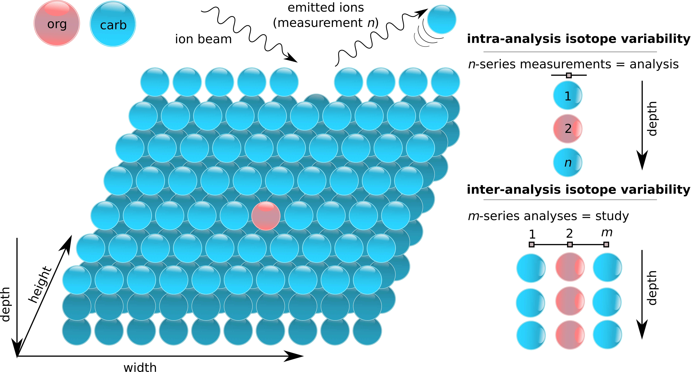
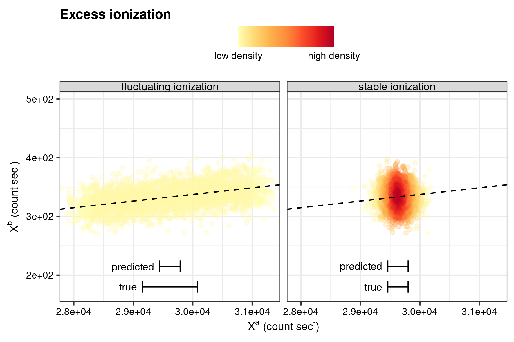
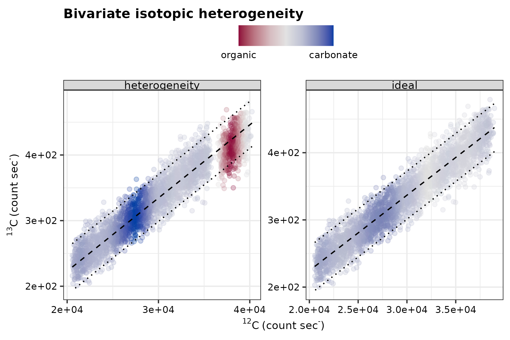
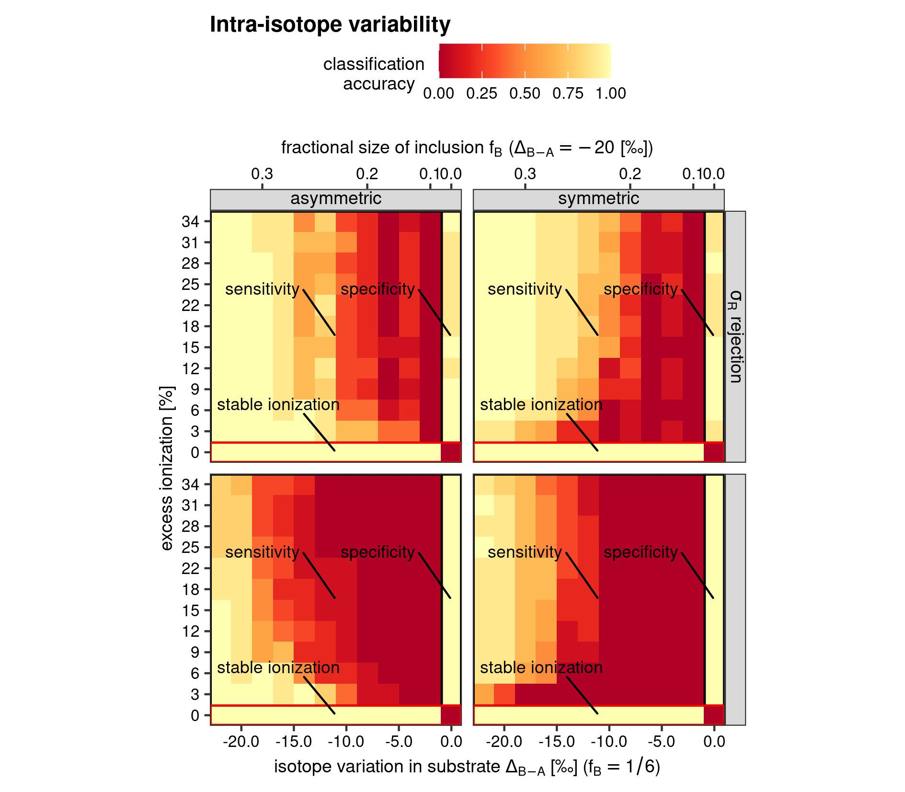
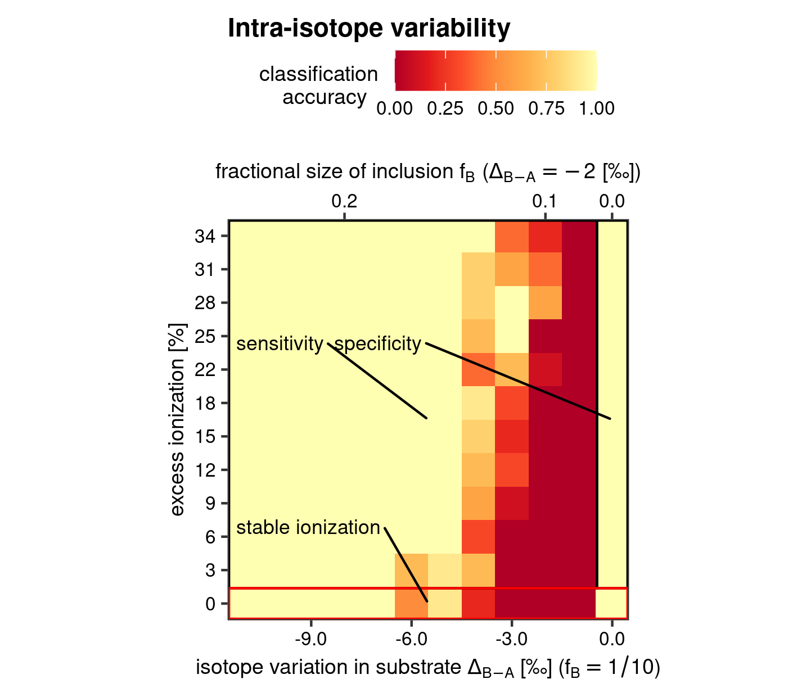
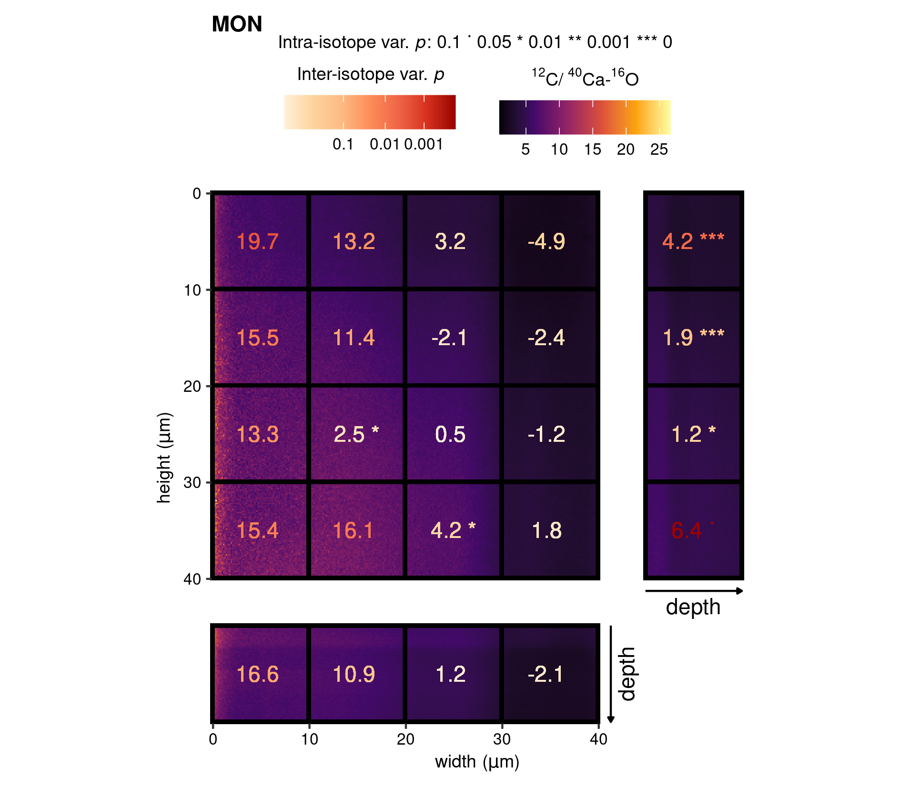
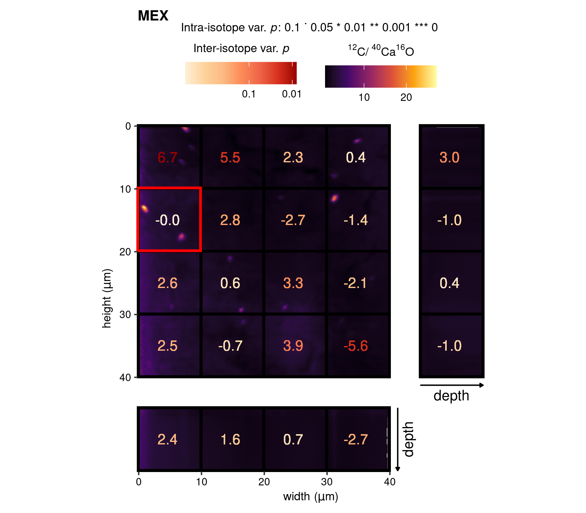
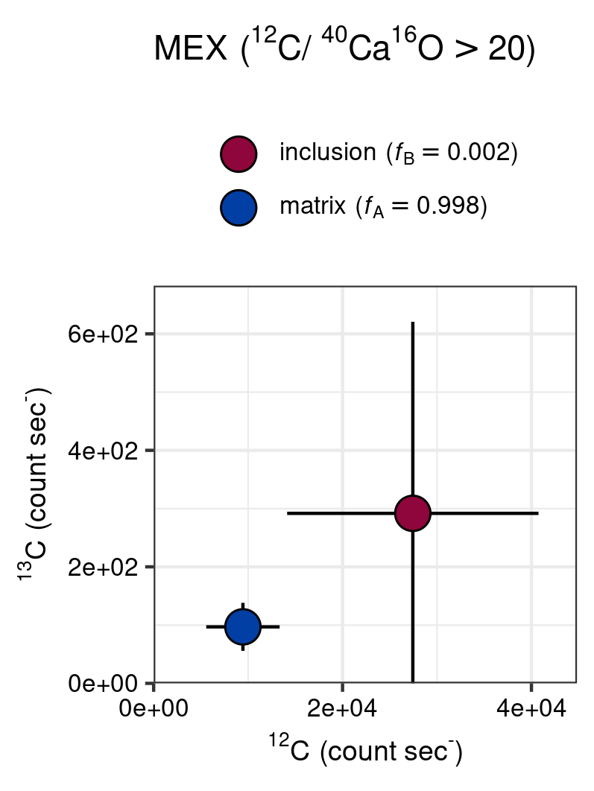

# Introduction


Secondary ion mass spectrometry (SIMS) is one of the techniques that allow high-accuracy isotope ratio (IR) analyses of solid-phase materials. Due to its superior spatial resolution, capability of IR analyses on light elements, and the commercial availability of high end instruments (e.g., Cameca^TM^ 1270, 1280, nanoSIMS 50L), SIMS has been increasingly applied in the field of geology and biogeochemistry [e.g., @Fike2008; @Rollion-Bard2007; @Kozdon2009a; @Wacey2011; @Kilburn2015a; @Wei2015; @Lin2016]. However, these applications are currently limited by the lack of reliable and well characterized reference materials [@Jochum2008; @Ramsey2018], which are required to ensure consistency in the accuracy of measurements conducted in different laboratories [@Verkouteren2004].

One of the factors that hamper the development of reference materials (RM) suitable for SIMS analyses is the difficulty to detect whether a potential reference material, be it natural or synthetic, is homogeneous on the scale of a SIMS analysis. To assess the material homogeneity, a SIMS study typically consists of a series of $m$ analyses conducted in multiple sputter pits on the material surface (e.g., along a transect), with each analysis comprising a series of $n$ measurements along the depth in the material (Fig. \@ref(fig:sketch)). In order for the aformentioned approach to be successful one needs to validate whether: 1) the individual analyses are accurate, and 2) if the material analysed with depth of the sputter pit was homogeneous or varied among the $n$-series of measurements. It is likely that heterogeneity might also manifest itself at the scale of a single analysis [@Verkouteren2004; @Jochum2008]

In a cursory overview, accuracy can be affected by a random bias attributed to quantum mechanics, dictating the chance of an atom being ejected as an secondary ion ("fundamental imprecision") [@Schroeer1973; @Shimizu1982], and a range of machine-specific systematic biases related to secondary ion production, transmission and detection [@Rudat1979; @Slodzian1980; @Shimizu1982; @Eiler1997; @Hervig2006]. The fundamental imprecision in secondary ion generation is accommodated by increasing the number of observations (increasing the $n$-series of measurements), thus optimizing the precision of an analysis according to count (or Poisson) statistics [@Fitzsimons2000a; @Kilburn2015a]. Whereas, corrections can be made for some of the systematic biases, such as the distinct time-interval of electronic paralysis (or "deadtime") of ion detection devices known as electron multipliers [@Fitzsimons2000a; @Kilburn2015a]. Other systematic biases show a strong correlation with the analysed material ("matrix effect") [@Slodzian1980; @Eiler1997], and are therefore routinely corrected by normalization with a matrix-matched RM measured along with the target material [@Fitzsimons2000a; @Kilburn2015a]. Enhancing again the notion that RM development, and thus the evaluation of material homogeneity, is at the core of SIMS method development. 

Ascertaining material homogeneity, especially at the scale of individual analysis, remains thus a weak link in the development of RMs and the applicability of SIMS to understand biogeochemical processes in natural materials. On top of that, the SIMS technique, as opposed to conventional gas-sourced isotope ratio mass spectrometry (IRMS) on e.g. carbonate (by means of acid digestion; e.g., gasbench or Kiel Carbonate Device), is indiscriminate towards impurities in the analyte. In the case of producing a carbonate-based RM, this means that not only ^13^C/^12^C ($R$) variations within the crystal lattice, or between carbonate minerals, are a cause of concern, but also matrix impurities, such as organic carbon, with generally relatively ^13^C-depleted signatures compared to the host carbonate, and therefore the composite SIMS-based ^13^C/^12^C analysis ($n$-series of measurements) could give a biased view (intra-analysis isotope variation; Fig. \@ref(fig:sketch)). Whereas, acid-digestion during the Gasbench-IRMS procedure minimises such mixing effects of carbonate-hosted organic carbon [however, see @Oehlerich2013]. The assigned (averaged) value and uncertainty of an RM is based on a $m$-series of analysis, where intra-analyses isotope variation in the set of analyses (Fig. \@ref(fig:sketch)) can skew both the averaged value and the uncertainty. 


```{r sketch, out.width="75%", fig.cap="Conceptual model of heterogeneity in the analyte can lead to intra- and inter-isotope variability (e.g.,  $^{13}$C/$^{12}$C) when unobscured (visible on surface) and obscured from view (inclusion at depth). Here, the matrix is represented by carbonate (component A) and the anomolous material is represented by organic matter (component B), which is usually relatively more $^{13}$C-depleted."}

```

Existing techniques to detect isotope variability in SIMS-generated ion count data involve a univariate approach to detect anomalous isotope ratios at the scale of measurements and analyses [Cameca^TM^ Software and @Ramsey2018]. These techniques consist of a threshold value validation, based on a measure of dispersion, generally a band of two times the standard deviation around $R$. But due to the generally high variation among measurements in a $n$-series of measurements, this technique is perhaps not particularly specific under all conditions, and thus conspicuous values might be part of the inherent random variation related to the aforementioned ionization process. Hence, we propose an alternative bivariate regression based technique that could resolve these limitations. In extension, we use inference statistic to make statements about the probability whether the secondary ions are likely to be the product of a homogeneous analyte in the case of single analyses (intra- analysis isotope variability) and complete studies (inter-analysis isotope variability).


# Theory {#sec:theory}

Under ideal circumstances (in the absence of analyte heterogeneity and under optimal instrumental conditions), variation in SIMS isotope ratios of a single analysis are only a consequence of the random nature of the emission of secondary ions. The latter is a result of similar ionization potentials for isotopes of the the same element, and this results in a positive and proportional relationship among count rates for isotope species [@Fitzsimons2000a]. Hence, the paired count rate measurements in one analysis of isotope species $a$ holds auxiliary information which is correlated with isotope species $b$. This information can be illustrated as a scatterplot and by fitting a linear model (Fig. \@ref(fig:ionization)), where scatter about the regression line represents the random nature of the emission of secondary ions. Note, that in Figure \@ref(fig:ionization) both "ideal" linear models represent an isotopically “homogeneous” analyte with the same $R$. The difference in the density of the data points plotted on a cartesian coordinate system is the result of differences in the ionization efficiency throughout an analytical run. Ionization efficiency represents the amount of secondary ions produced relative to incident primary ions, and under aforementioned ideal analytical circumstances the efficiency of secondary ion extraction is only subjected to change by gradual charge build-up on the sample surface and changes in the geometry of the sputter pit under ongoing bombardment [@Fitzsimons2000a]. Notably, low variability in ionization efficiency causes the data points to accumulate in a single, dense elliptical cluster (panel "stable ionization" of Fig. \@ref(fig:ionization)), whereas high variability in ionization efficiency elongates the cluster along one plane (panel "fluctuating ionization" of Fig. \@ref(fig:ionization)). This plane corresponds with the $R$ of the analyte (or the slope of the linear model in Fig. \@ref(fig:ionization)) under ideal circumstances. The shape of the cluster further corresponds to the difference in the range demarcated by the standard deviation ("true" in Fig. \@ref(fig:ionization)) and the fundamental imprecision according to count statistics ("predicted" in Fig. \@ref(fig:ionization)), about the mean of isotope species $a$ [see Supplementary Section \@ref(sec:precision) and  @Fitzsimons2000a for details concerning statistics of count data]. We will use this difference in actual and predicted precision, or "excess ionization", as the formalised representation of ionization efficiency throughout this work.  


```{r ionization, fig.cap="Synthetic dataset of SIMS isotope count rate analyses under ideal cicumstances; i.e., optimal machine specifications and a homogeneous analyte. The only difference between the two panels is the ionization efficiency (i.e., the amount of secondary ions produced by incident primary ions) throughout the analytical run, where \"stable ionization\" represents near-to equal count rates throughout the analysis, and \"fluctuating ionization\" demarcates variations during the analysis. The error bars \"true\" and \"predicted\" represent the standard deviation ($s_{X^{a}}$) and predicted standard deviation ($\\hat{s}_{X^{a}}$) about the mean of isotope species $a$, respectively."}

```


We can also formalise the "ideal" linear model for SIMS isotope count rates (Fig. \@ref(fig:ionization)), as the correlated auxiliary information among isotope species enables so-called ratio estimation of matched pairs of variables, where the ratio estimate can be used to predict the count rates of $X^b$ through a linear combination with the observed count rate of $X^a$. 

\begin{equation}
E \left(X_i^b \mid X_i^a \right) = RX_i^a \qquad \text{if} \qquad R > 0 (\#eq:linR)
\end{equation}

In this formulation, $R$ is quantified as the ratio of means of the population.

\begin{equation}
R = \frac{\mu^{b}}{\mu^{a}} (\#eq:linpopR)
\end{equation}

The ratio estimator $\hat{R}$ is used to approximate $R$. This value is the same as ratio of means of the observed count rates ($\bar{R}$), and this is typically the final value reported for a SIMS isotope analysis. For large samples, the uncertainty associated with $\hat{R}$ becomes small and approximates a normal distribution. This is also typically the case for SIMS $\bar{R}$, where a precision of better than `r permille(1)` is custom under the right machine specifications.  

\begin{equation}
\hat{R} = \bar{R} = \frac{ \frac{1}{n} \sum_{i=1}^{n} X_i^b }{ \frac{1}{n} \sum_{i=1}^{n} X_i^a} (\#eq:estR)
\end{equation}

This leads to derivation of an "ideal" linear model for “homogeneous” isotope count data. 

\begin{equation}
\hat{X}_i^b = \hat{R}X_i^a + e_i \qquad \text{where} \quad e_i \sim N \left(0,\sigma^2 \right) \quad \text{if} \quad  X_i^a, X_i^b \gg 0 (\#eq:linmodR)
\end{equation}

The error term ('residuals'; $e_i$) of this linear function are assumed to be normally distributed with an expected mean of zero. These conditions will be satisfied if the count rates are sufficiently high and the Poisson distribution for the counts approximates a normal distribution [see Supplementary Section \@ref(sec:precision) and @Fitzsimons2000a; @Kilburn2015a]. Although the residuals ($e_i$) of the  linear model, and their variance $\sigma^2$, are unobserved, they can be approximated, as follows:

\begin{equation}
 \hat{e}_i =  X_i^b - \hat{R}X_i^a  \qquad \text{with} \quad  \hat{\sigma}^2 = \frac{1}{n-1}\sum_{i=1}^{n} (X_i^b - \hat{R}X_i^a)^{2} \text{.} (\#eq:resR)
\end{equation}

<!-- Minimization of $\hat{\sigma}^2$ by the Ordinary Least Squares (OLS) method forms the basis for finding the optimal parameter set for the ordinary linear regression model [e.g. @Zuur2008; @Fox2018]. Furthermore,  -->

The unexplained portion of the model has the convenient property that it helps measure the goodness of the model fit on the observed count rates. It thus follows, that $\hat{e}_{i}$ yields information about $\hat{R} \sim R$, and that unusual values for $\hat{e}_{i}$ might indicate an isotopically heterogeneous source. Returning to our example of a carbonate-based RM (Fig. \@ref(fig:sketch)), these properties of the ideal linear model enable detecting of the hypothetical ^13^C-depleted organic carbon impurities within a predominant carbonate matrix (with a relative ^13^C-enriched signature). This intra-isotope can be illustrated in the same bivariate regression based representation of paired count rate measurements in one analysis (Fig. \@ref(fig:hetero)). In this example (Fig. \@ref(fig:hetero)), the linear model (dashed line) is complemented with two additional dotted lines demarcating the bounds of the fundamental imprecision of $R$, based on Poisson statistics [$\sim 2 \times \hat{s}_{R}$, see Supplementary Section \@ref(sec:precision) and  @Fitzsimons2000a for Poisson statistics]. In the case of isotopic heterogeneity, the deviation from the ideal linear model can be clearly discerned, where the data points of the anomalous component of the analysis are red (i.e., ^13^C-depleted organic carbon).


```{r hetero, fig.cap="Synthetic dataset of SIMS isotope count rates for an analtyical run with heterogenous and homogeneous $^{13}$C/$^{12}$C. This example approximates natural conditions."}

```


It is important to recognise that the isotopic anomaly in Figure \@ref(fig:hetero) can be expressed as an isotopic offset and the fraction of $n$ measurements ($f$) of the isotopic anomalous component. Both definitions are two sides of the same coin and can be expressed with a mass balance.

\begin{equation}
  R = R_{A}(1-f) + R_{B}f 
  (\#eq:MB) 
\end{equation}

Applying this expression to the hypothetical carbonate-based RM (Fig. \@ref(fig:sketch)) shows that both the isotopic composition and the size of the allochthonous organic component $B$ in the carbonate matrix $A$ are factors dictating the impact on the final SIMS isotope value. The impact can be inferred by usage of the ideal linear model (Eq. \@ref(eq:linmodR)) and the characteristic of $\hat{e}_{i}$. This is known as regression diagnostics (or residual analysis) and forms the basis for the here-introduced methods to detect isotopic heterogeneity. 

# Methods

## Regression diagnostics {#sec:RegDia}

Residual analyses diagnoses problems with a linear model by interrogation and transformation of the data. Hence these methods yield estimates about the data points that could have unduly influenced the coefficient $\hat{R}$ in Equation \@ref(eq:linmodR). Outliers detected in linear regression can therefore be described as an observation with a response variable (isotope species; $X_i^b$) that is conditionally unusual when regarding the independent variable (isotope species; $X_i^a$). This in contrast to the traditional univariate outliers identified by threshold cut-off $R_c$ values for $R_i$, usually the standard deviation of the mean of ratios (Eq. \@ref(eq:estR)), which is different from the standard deviation (of the ratio of means; Eq. \@ref(eq:linpopR)) with errors propagated from single ion count rates [Supplementary Section \@ref(sec:precision) and @Fitzsimons2000a]

\begin{equation}
R_c =\sqrt{\frac{\sum_{i=1}^{n}  \left(  R_{i} - \bar{R} \right)^{2} } {n-1} } (\#eq:cameca)
\end{equation}

This method is, for instance, implemented in the Cameca^TM^ software, and is henceforward referred to as $\sigma_R$-rejection. The bivariate regression based method is more complex as the mere identification of outlyingness of a data point in a linear model does not necessarily classify as a data point that could influence the coefficient $\hat{R}$. If, for example, an observation falls close to the mean of the independent variable, then these data points have minimal leverage on the coefficients. Leverage can be formulated as the distance from the mean of the independent value  which is proportional to weight the value ($h_i$) has on the response value [e.g., @Fox2018].

\begin{equation}
h_{i} = \frac{1}{n} + \frac{(X_{i}^{a} - \bar{X}^{a})^{2}}{\sum_{j=1}^{n}(X_{j}^{a} - \bar{X}^{a})^{2}} (\#eq:lev)
\end{equation}

On the other hand, studentized residuals are a measure of a data points outlyingness, which overcomes the scale-dependence of $\hat{e}_i$ through normalization. A studentized residual ($\hat{e}_i^*$) is obtained by dividing the residual by an independent estimate of the standard deviation of the residuals. To ensure independence, the model is refitted to data with the $i$-th observation left out, allowing the standard deviation to be calculated on the remaining $n-1$ residuals [e.g., @Fox2018].

\begin{equation}
 \hat{e}_i^* = \frac{\hat{e}_i}{S_{\hat{e}_{(-i)}} \sqrt{(1-h_i)}} (\#eq:studres)
\end{equation}

A measure routinely applied to quantify influence of data points on the regression model is Cook's Distance (or Cook's D) [e.g., @Fox2018], which accommodates for both the leverage and the outlyingness of data points, as defined in Equations \@ref(eq:lev) and \@ref(eq:studres).

\begin{equation}
  D_i = \frac{\hat{e}_{i}^{*}{}^2}{k + 1} \times \frac{h_i}{1- h_i} (\#eq:CD)
\end{equation}

Here, the $k$ stands for the number of coefficients in the regression model. To quantify whether $D_i$ is substantially larger then the rest of the sample's $D$ a critical value is usually defined as follows. 

\begin{equation}
  D_c = \frac{4}{n-k-1} (\#eq:CDcut)
\end{equation}

This approach allows the sub-setting of the ion counts that might have disproportional influence on $\hat{R}$. Since random variation in the emitted secondary ions will always cause some "spurious" outlying data points, a measure of the significance of the data points marked as "influential" is still required. Note, that this is also the case for the univariate $\sigma_R$-rejection method. 


## Intra-isotope variability: Significance of influential data points {#sec:intra}

A joint model coefficient hypothesis test is used to make inferences about the effect of influential and outlying values in an $n$-series of measurements on $\bar{R}$. This approach measures the potential whether there is a deviation from the ideal linear model (Eq. \@ref(eq:linmodR), which is the restricted model of the hypothesis test. The unrestricted model is then an extension of the ideal model with the introduction of an additional two-level ($C$) nominal factorial ($\lambda_i^C$), identifying the influence and outlyingness of a data point, thereby yielding;

\begin{equation}
\hat{X}_i^b = \hat{R}X_i^a + \hat\beta_1 \lambda_i^{C} + \hat\beta_2 X_i^a \lambda_i^{C} +  e_i \text{.} (\#eq:fullmodR)
\end{equation}

Two new parameters ($\hat\beta_1$ and $\hat\beta_2$) are introduced in Equation \@ref(eq:fullmodR) in order to subject $\lambda_i^C$ as an additive, and a multiplicative component, to the continuous variable ($X_i^a$). This nominal factorial is encoded as a $C-1$ indicator variable ($\lambda_i^{C}$) taking a value of $0$ or $1$ based on the residual diagnostics test (e.g., Cook's D), and thus representing a value suspect to be an outlier and/or influential data point. The outliers detected by residual analysis are re-centered around the fitted values of the restricted model (Eq. \ref{eq:linmodR}) before application of the regression model to ensure a unimodal distribution of residuals of the unrestricted model. Hence the likelihood $L$ of the parameter(s) ($\theta$) fitting the data ($L(\theta_{0}|X^a)$) in the case of the restricted model can be tested against the unrestricted model ($L(\theta_{1}|X^a)$). A Fisher Test compares $L$ under model reduction, where the approach uses the residual sum of squares ($RSS = \sum_{i=1}^n \hat{e}_i^2$) of the restricted and unrestricted model, respectively.

\begin{equation}
F_{(q-k),(n-q)} = \frac{ (RSS_{\theta_{0}}-RSS_{\theta_{1}}) / (q-k) }{RSS_{\theta_{1}} / (n-q)} (\#eq:Fisher)
\end{equation}

In this formulation the obtained test statistic follows a $F$ distribution with the degrees of freedom derived from the numbers of parameters in the unrestricted model ($q=3$; Eq. \@ref(eq:fullmodR)), restricted model ($k=1$; Eq. \@ref(eq:linmodR)), and the number of observations ($n$). This $F$ value can be tested against a critical value ($F > F_{(2),(n-3)}^\alpha$) to obtain the probability that a value falls within a pre-defined confidence level ($\alpha$). The model reduction leads to the null hypothesis; $H_{0}: \hat{R} = \bar{R}$, and the alternative hypothesis; $H_{a}: \hat{R} \neq \bar{R}$. The rejection of this hypothesis can therefore be interpreted as that the residual analyses improved the approximation of $\hat{R}$, and, by extension, that $\bar{R}$ likely arises from a homogeneous population. 


## Inter-isotope variability

Inter-isotope variability is defined as the difference in $\bar{R}$ among an $m$-series of analyses, such as typically produced in a study. For this series of analyses, we can then define the "grand mean" as $\bar{\bar{R}} = \frac{1}{m}\sum_{j =1}^{m}\bar{R}_j$. If the substrate would be isotopically homogeneous across its surface, then each analysis would approach $\bar{\bar{R}}$. This can again be described by the "ideal" linear model of Equation \@ref(eq:linmodR) for an isotopically "homogeneous" substrate, where the $m$-series is viewed as one long analysis of $n$-measurements ($m\sum_{i=1}^{n}X_{i}^{a \mid b}$). Introduction of a nominal factorial that interacts with $\hat{R}$ can therefore also be used  to account for inter-isotope variability, except that in this case the levels are encoded to represent the $j$-th analysis of the $m$-series of analyses. Encoding of this nominal variable can in theory constitute as many analyses as needed, potentially creating excessive parameters when considered as a fix component. This nesting structure, that is of no particular interest, is therefore instead represented as a random effect. This introduces a second level in Equation \@ref(eq:linmodR), where each nest ($j$-th analysis) can assume a different $\hat{R}$, that is, different $\bar{R}$ may exist among the various analysis.

\begin{equation}
  \begin{split}
  & \text{level 1:} \quad \hat{X}_{ij}^b = \hat{R}_{j}X_{ij}^a +  \hat{e}_{ij} \qquad \text{where} \quad  \hat{e}_{ij} \sim N(0,\hat{\sigma}^2)   \\
  & \text{level 2:} \quad \hat{R}_{j} = \hat{\bar{R}} + \hat{u}_{j} \qquad \text{where} \quad \hat{u}_{j} \sim N(0, \hat{t}^2) (\#eq:mlm)
  \end{split}
\end{equation}

In Equation \@ref(eq:mlm) subscript $j$ encodes then for the analyses (cq. nest). The parameter $\hat{\bar{R}}$ of the second level is now a general coefficient, that approximates the grand mean of an $m$-series of analyses, whereas $\hat{u}_{j}$ introduces a new error component, which is specific for each nest (cq. analyses) and follows a normal distribution with variance $\hat{t}^2$ and a mean of $0$. This new error component encodes for the nest-specific deviations, or random effects, superimposed on the $\bar{\bar{R}}$, here approximated by $\hat{\bar{R}}$. The purpose of the $m$-series of analyses is to approximate the variation in the true population through sampling at multiple instances (i.e. along a transect of sputter pits on the substrate). For these types of questions; i.e., is the substrate isotopically homogeneous or heterogeneous, a mix of fixed and random effects (known as a mixed effect linear models) is of particular high value. The variance of $R$ (level 1 of Eq. \@ref(eq:mlm)) among the $m$-series of analysis, together with the second level fixed component $\hat{\bar{R}}$, can be re-cast as a relative standard deviation of the coefficient:

\begin{equation}
  \hat{\epsilon}_{\bar{R}} = \frac{\sum_{j = 1}^{n}  \left(\frac{\hat{R}_{j}}{\hat{\bar{R}}} - 1 \right)^{2}}{n-1}  \times 10^3  \text{.} (\#eq:varmlm)
\end{equation}

This formulation can thus serve as an alternative measure of dispersion in a sample when studying the isotope composition of a substrate. In addition, the fit of the mixed effects model can be compared to the restricted model (the ideal linear model of Eq. \@ref(eq:linmodR). For this comparison, Restricted Maximum Likelihood (REML) optimization is used to estimate parameters for both the restricted fixed effect (Eq. \@ref(eq:linmodR)) and the unrestricted mixed effect models. By contrast to the ratio method estimation (Section \@ref(sec:theory)), this method is a computational iterative process of selecting parameters that maximize the likelihood of obtaining the sample data with a particular parameter ($L\left( \theta_{0} \mid X^{a} \right)$), known as a log-likelihood function [see @Zuur2008 for the functions and their theoretical underpinning]. The REML solver is particularly useful when the random component is the focus of interest [@Kreft1998; @Finch2014], as it does not rely on estimates of model parameters for maximization of the log-likelihood function, and is therefore unbiased [@Zuur2008]. The ratio of the obtained log-likelihood (i.e., maximized likelihood functions) for the restricted model and the unrestricted model, or likelihood-ratio test (LR), can be applied to deduce the significance of including a random component in Equation \@ref(eq:linmodR) [@Molenberghs2007; @Zuur2008].

\begin{equation}
\text{LR} = - 2\ln \left( \frac{L(\theta_{0} \mid X^{a})}{L(\theta_{1} \mid X^{a})} \right) = 2(\text{loglik}(\theta_{1}) - \text{loglik}(\theta_{0})) (\#eq:loglik)
\end{equation}

The LR test score, in the case of here-outlined addition of one random variable, follows a $\chi^{2}$ distribution with one degree of freedom ($\chi^2_{1}$) divided by $2$ [@Molenberghs2007; @Zuur2008]. The null hypothesis is $H_{0}: t^{2} = 0$ , and the alternative hypothesis is $H_{a}: t^{2} > 0$. Rejection of $H_{0}$ could suggest a significant improvement upon introduction of the random coefficient, and indicates that $\bar{R}_{j}$ might substantially deviate from $\bar{\bar{R}}$, thereby pointing to potentially significant isotopic variability among the analyses. The mixed linear model approach therefore represents an alternative solution to traditional descriptive statistics and error propagation following Taylor series expansion [Supplementary Section \@ref(sec:precision) and @Ku1966; @Fitzsimons2000a], which could be used as well to construct a similar type of analyses of variance, but where the here-outlined procedure would be more robust to violations of homogeneity and heterogeneity of the data [@Zuur2008]


# Performance of the intra- and inter-isotope variability tests {#sec:performance}

The performance of the here-developed models was measured by applying the intra- and inter-isotope variability tests to a synthetic SIMS isotope count dataset (see Supplementary Section \@ref(sec:simulation) for the protocol of synthetic data generation). Predictions by the tests on synthetic data allow comparisons with the known parameter settings used for generating the synthetic data (e.g., isotopic homogeneity and heterogeneity). To clarify this comparative evaluation, we return again to the hypothetical scenario of a carbonate-based RM (Fig. \@ref(fig:sketch)), and our ability to predict whether isotopically anomalous organic carbon impurities skewed the averaged SIMS isotope value in such situations. First of all, we simulated count data that mimics a carbonate with organic impurities and check the test's ability to successfully predict isotopic heterogeneity, these instances are also known as True Positive (TP) predictions. These TP predictions are matched by False Negative (FN) predictions, when synthetic isotopically heterogeneous data is incorrectly classified as homogeneous. Equally important is the ability of the intra- and inter-isotope variability tests to classify the idealized homogeneous carbonate-based RM ("no impurities") as an isotopically homogeneous dataset. This classification type is known as a True Negative (TN) prediction. The opposite of this situation is the False Positive (FP) prediction, or "Type I errors", implying isotopic heterogeneity when in reality there is none. 

This model validation is formalised by standard model classification metrics; accuracy, sensitivity and specificity, which rely on repeated simulations of synthetic data. For example, a synthetic dataset existing of 10 carbonate-based RM with a certain degree of organic impurity and 10 perfectly homogeneous carbonates is repeatedly classified by the isotope variability tests to gauge the rate of overall successful classification;  

\begin{equation}
\text{accuracy} = \frac{\text{TP}\, + \,\text{TN}}{\text{total}} \text{,}   
(\#eq:accuracy)
\end{equation}

the rate of detecting isotopic heterogeneity;

\begin{equation}
\text{sensitivity} = \frac{\text{TP}}{\text{TP}+\text{FN}} \text{,} 
(\#eq:sensitivity)
\end{equation}

and the rate of detecting isotopic homogeneity;

\begin{equation}
\text{specificity} = \frac{\text{TN}}{\text{TN}+\text{FP}} \text{.}
(\#eq:specificity)
\end{equation}

Synthetic data simulation and subsequent application of the classification metrics on the intra- and inter-isotope variability test was executed over a range of values for the excess ionization and varying isotopic offsets. The isotope ranges where selected based on literature $\delta$ values relative to Vienna PeeDee Belemnite (VPDB). The $\delta$-notation in `r permille(NULL)`, follows from:  

\begin{equation}
  \delta = \left( \frac{R_j}{R_x} - 1 \right) 10^3 \,\text{,} 
  (\#eq:delta)
\end{equation}

where $R_j$ represents a single analysis and $R_x$ a reference standard (e.g., VPDB). The hypothetical scenario of assessing the suitability of a carbonate-based RM (Fig. \@ref(fig:sketch)) is used as a reference scenario in regard to isotopic offsets related to organic carbon and/or authigenic carbonate formed in the presence of respired carbon [@Hayes1999; @Schrag2013]. For the intra-isotope variability test validation, this approach was further refined to detect two specific types of intra-isotope variability. The first type is signified as "asymmetric isotope variation", and would approximate a situation in which the primary ion beams cuts through an organic inclusion with depth within a predominant carbonate matrix, and thus both the matrix and isotopic composition deviate between components $A$ and $B$ (Fig. \@ref(fig:sketch) and Supplementary Fig. \@ref(fig:concept)). The second scenario is referred to as "symmetric isotope variation" which represents a gradient exclusively in expressed in the $R$ values (Supplementary Section \@ref(sec:simulation) and Supplementary Fig. \@ref(fig:concept)). The selected parameter settings of modelled excess ionization are based on SIMS ^13^C/^12^C analysis on carbonates with a Cameca NanoSIMS 50L (Utrecht University, Netherlands). Finally, both the univariate $\sigma_R$-rejection method and bivariate Cook's D method can be used to detect outliers, and thus their ability to correctly classify the intra-isotopic variability of the synthetic data is compared in this model validation exercise. 

Heatmaps are used to visualize the accuracy of the intra- and inter-isotope variability tests in response to the selected ranges for excess ionization and isotopic offsets (e.g., Fig. \@ref(fig:effect)). A clear step-wise pattern can be discerned with increasing excess ionization, where stable ionization yield causes failure of model classification in all instances for scenarios with a homogeneous internal isotopic composition (accuracy = $0$; Fig. \@ref(fig:effect)). It thus follows, that even though the whole range of intra-isotopic variation under stable ionization yield has an $100$% accuracy score (Fig. \@ref(fig:effect)), the failure to detect isotopically homogeneous substrates hampers the intra-isotope test's application under these conditions. The pattern reverses when only minimal systematic variation in ionization yield is introduced, where in the case of Cook's D based diagnostics, the intra-isotope test faithfully detects isotopically homogeneous substrates, resulting in a specificity of $100$% (Eq. \@ref(eq:specificity)). The specificity of the $\sigma_{R}$-rejection method is slightly lower (~$90$%), indicating a potential bias (Fig. \@ref(fig:effect)), where Type I errors might lead to erroneous conclusions if not accounted for; i.e., assigning intra-isotopic variability to an analysis where in reality there exists none. 


```{r effect, fig.cap=paste0("Heatmap for model classification accuracy $[(\\text{TP} + \\text{TN}) / \\text{total}]$ with varying degrees of substrate intra-isotope heterogeneity, where the difference in the isotopic composition of the simulated components $A$ and $B$ ($\\Delta_{B-A} = \\delta^{13}C_{B} - \\delta^{13}C_{A}$) range between ", permille(-22), " and ", permille(0), ", and excess ionization with a range of $0$\\%--$34$\\% ($\\epsilon_{\\bar{X^{a}}} - \\hat{\\epsilon}_{\\bar{N^{a}}}$, Supplementary Section \\ref{sec:precision}). The accuracy of the $\\sigma_{R}$-rejection and Cook\'s D to classify intra-isotope variance is, furthermore, tested for the two hypothetical scenarios of symmetric and asymmetric isotopic heterogeneity of the analyte (Supplementary Section \\ref{sec:simulation} and Supplementary Fig. \\ref{fig:concept}). The secondary x-axis exemplifies the accuracy of the test in terms of the size fraction ($f_{B}$), when the anomalous isotope component ($B$) has an isotope composition $20.0$", permille(NULL), " lower compared to the remaining fraction $A$ of the analysis.")}

```


In the presence of systematic variation in ionization yield (higher excess ionization) both the $\sigma_{R}$-rejection and Cook's D based diagnostics are sensitive to intra-isotopic variation if the isotopic offset ($\Delta_{B-A} = \delta^{13}C_{B} - \delta^{13}C_{A}$) is `r permille(-15, sign = TRUE)` or lower, where the former method might be slightly more sensitive at smaller $\Delta_{B-A}$ than the latter (Fig. \@ref(fig:effect)). The Cook's D based diagnostics has comparatively low sensitivity for asymmetric intra-isotope variation (even at large $\Delta_{B-A}$) at the lower ranges  of excess ionization (~$4.0$%) (Fig. \@ref(fig:effect)), when compared to the $\sigma_{R}$-rejection method. Recall from Section \@ref(sec:theory) that these isotopic offsets can also be expressed as the mass fraction of the isotopic anomalous component (secondary x-axis of Fig. \@ref(fig:effect)).

The method developed for inter-isotope variability does not suffer from classification failures in the absence of systematic variation in the ionization efficiency (Fig. \@ref(fig:heatmap2)). Furthermore, accurate detection for the presence of $1$ anomalous analysis $B$ from a total of $10$ analyses is achievable with a deviation of `r permille(5)` ($\Delta_{B-A}$, where $A$ comprises the isotope composition of the remaining $9$ samples). Also, for this sensitivity run, a mass balance (Eq. \@ref(eq:MB)), where the fraction ($f$) comprises now the integer value for the anomalous isotope analyses $B$, can be used to frame sensitivity in terms of the size fraction of the total set of analyses. Doing so (secondary x-axis of Fig. \@ref(fig:heatmap2)), suggests that a modest `r permille(2)` variation in more than $1$ analysis should be detectable with this method.


```{r heatmap2, fig.cap=paste0("Heatmap for model classification accuracy $[(\\text{TP} + \\text{TN}) / \\text{total}]$ with varying degrees of substrate inter-isotope heterogeneity, where the difference in isotopic composition of the simulated analyses $A\\,(n = 1)$ and $B\\,(n = 9)$ ranges between", permille(-11), " and ", permille(0), ". Varying degrees of variance in the ionization efficiency trend are included, with a range of $0$\\%--$34$\\% ($\\epsilon_{\\bar{X^{a}}} - \\hat{\\epsilon}_{\\bar{N^{a}}}$). The secondary x-axis exemplifies the accuracy the test in terms of the size fraction, when the anomalous isotope analyses ($A$) have an isotope composition $2.0$", permille(NULL), " lower compared to the remaining fraction $B$ of analyses.")}

```


# Detecting isotopic heterogeneity with the R package `point` {#sec:point}

The R package `point` was developed to facilitate a convenient implementation of the here-introduced tests, which are included in the diagnostic function `diag_R()`. Besides these diagnostics, the package further allows convenient loading, tabulating and aggregation of ion count data in terms of summary statistics for internal and external precision [Schobben, in prep and @point]. The released version of `point` can be installed from Github as follows (after initial reviews the R package will be submitted to CRAN).


```
# Install point from GitHub:
# install.packages("devtools")
devtools::install_github("MartinSchobben/point")
```

The required structure of the ion count data for application of `diag_R()` can mostly easily be obtained by loading the raw SIMS ion count data with the `point` function `read_IC()`, and by subsequently applying corrections for detector biases (dead-time, detector yield and blanking) with the `cor_IC()` function [see Schobben, in prep and the documentation of @point for extended details on this work-flow]. In the following, we will use `<` and `>` to demarcate user-supplied information written in upper-case, which should be replaced upon implementation by the user. The simplest implementation for intra-isotope variability requires assignment of groups (`<GROUPS>`) to the dot-dot-dot argument (`...`), which can be any number of variables that uniquely identify subsets of measurements (e.g., the individual analysis) within the ion count data (`<DATA>`) assigned to the argument `.IC`. Taking again the example of an ^13^C/^12^C homogeneous carbonate-based RM (Fig. \@ref(fig:sketch)), the arguments `.ion1 = "13C"` and `ion2 = "12C"`, respectively, refer to the rare and common isotope of the targeted isotope system. For advanced functionality, check the manual (`?diag_R()`) or documentation of @point (list of all vignettes with `vignettes(package = "point")`).


```
# Load point with library.
library(point)
# Intra-isotope test
diag_R(.IC = <DATA>, .ion1 = "13C", .ion2 = "12C", <GROUPS>)
```

To obtain the significance of inter-isotope variability along a series of analyses (e.g., along a sputter pit transect on the substrate), only one additional variable (`<NEST>`) should be added to the previous call. This variable supplied to the nest argument (`.nest`) should refer to the nesting structure ($j$-th analysis of the $m$-series in Eq. \@ref(eq:mlm)). Note, that again a variable identifying a grouping structure (`<GROUPS>`) should be supplied to the `...`, alongside the nest argument, when multiple $m$-series are included in the dataset (e.g., multiple transects, minerals or analytes).


```
# Intra- and inter-isotope test
diag_R(.IC = <DATA>, .ion1 = "13C", .ion2 = "12C", <GROUPS>, <NEST>, .nest = <NEST>)
```

To demonstrate the functionality of `diag_R()` in a real world application, and to provide additional constrains on the fidelity of the isotope variability tests, natural carbonates ("real" data) were analysed with a Cameca NanoSIMS 50L (Utrecht University, Netherlands). A crystalline calcite (MON) and a sedimentary carbonate rock [MEX, @Jochum2008; @Rollion-Bard2007] were selected to represent widely diverging end-members of carbonate minerals as found at Earth's surface, and are expected to encompass different forms of internal ^13^C/^12^C variability, mineralogy and phases. In addition to ^13^C/^12^C analyses, ion maps were produced for `r point::R_labeller("12C", "40Ca-16O")` and `r point::R_labeller("12C-14N", "12C")` (see Supplementary Section \@ref(sec:realdat) for all details of the materials, the analytical conditions during the measurements and subsequent data treatment). Despite the somewhat higher sensitivity of the $\sigma_{R}$-rejection method, the Cook's D based-test was selected for application on the real data (this is also the default method of `diag_R()`), as the superior specificity of the latter method limits the potential of erroneous detection of intra-isotope heterogeneity (Fig. \@ref(fig:effect)).

The ^13^C/^12^C data is aggregated on a grid of `r SI(10, c("micro", "metre"))` by `r SI(10, c("micro", "metre"))`, and is superimposed on the ion maps (e.g., `r point::R_labeller("12C", "40Ca-16O")` of Fig. \@ref(fig:MON)). The ^13^C/^12^C values are reported in the $\delta$ notation (Eq. \@ref(eq:delta)), where the grid-cell specific $j$-th $R$ analysis is normalised relative to the predicted grand mean ($\hat{\bar{R}}$) of the specific plane associated with $R_{j}$. The significance of intra-isotope variability is presented as significance stars, added as a suffix to the $\delta$^13^C values, and the grid-cell specific significance of inter-isotope variability (relative to the corresponding plane) is represented by the font colour of the $\delta$^13^C values (i.e., red is highly significant; e.g.,  Fig. \@ref(fig:MON)). Additional test statistics (predicted grand mean $\hat{\bar{R}}$, relative standard deviation $\hat{\epsilon}_{\bar{R}}$, the model optimization metric Akaike information criterion and the overall $p$-value for the significance of inter-isotope variability) relating to Equations \@ref(eq:mlm) and \@ref(eq:varmlm) of the mixed effect model are presented in tables (e.g., Table \@ref(tab:MONtab)) alongside conventional descriptive statistics for external precision for the different planes of both analytes (grand mean $\bar{\bar{R}}$ and the relative standard deviation $\epsilon_{\bar{R}}$ obtained with the `point` function `stat_R()`; see Schobben, in prep and the documentation of @point for extended details on this function).

Based on the ion map (Fig. \@ref(fig:MON)), the mineralogy of the crystalline MON is uniform over the analysed surface, whereas a large $\delta^{13}$C gradient from values higher than `r permille(point::calib_R(var_mean(dplyr::filter(pointapply::stat_R_64_all, sample.nm  == "MON"), "depth", 1:4, M_R_Xt.pr), pointapply::diag_64_MON[3,2], output = "delta"), sign = TRUE)` to an average of `r permille(point::calib_R(var_mean(dplyr::filter(pointapply::stat_R_64_all, sample.nm  == "MON"), "depth", 12:16, M_R_Xt.pr), pointapply::diag_64_MON[3,2], output = "delta"), sign = TRUE)` marks the the width of the analysed area from left to right. Counts aggregated over the width of the array further show that 3 out of 4 grid-cells record significant, to highly significant outliers suggesting that the gradient is also detectable as intra-isotope variability. Inter-isotope variance is significant for counts aggregated over the height and depth, but variance is lowest and non-significant perpendicular to the $R$ gradient (Table \@ref(tab:MONtab)). This cross-validation highlights the power of the test statistics, as the combination of intra- and inter-isotope variability, superimposed on the ion map (Fig. \@ref(fig:MON)), provides two independent, but complementary test results, both supporting high $R$ variability of MON. In addition, the range of variance (Table \@ref(tab:MONtab)) is higher than the internal precision (Supplementary Section \@ref(sec:precision)), further supporting the inference of the existence of a significant isotopic gradient in the analyte. 


```{r MON, fig.cap=paste0("Ion map (", point::R_labeller("12C", "40Ca-16O"), ") projection and superimposed ", SI(10, c("micro", "metre")), " by ", SI(10, c("micro", "metre")), " grid of highest-precision ", point::R_labeller("13C", "12C"), " (colored text labels) aggregated over the width, height and depth of the crystalline calcite (MON). Combined intra- and inter-isotope variability is integrated as, respectively, significance stars and color of the $\\delta^{13}$C (", permille(NULL), " relative to $\\hat{\\bar{R}}$), where t-test statistics were used to allow the representation of single analyses (plane-specific $\\hat{\\epsilon}_{\\bar{R}}$ and LR test statistics in Table \\ref{tab:MONtab}). The array encompasses 400 frames over the depth dimension (Supplementary Section \\ref{sec:realdat}).")}

```


(ref:foot1) \@ref(fig:MON)


```{r MONtab}
# conventional calculation of variance
stat_R_ext_64_all <- point::stat_R(pointapply::map_sum_grid_64_all, "13C", 
                                   "12C", sample.nm, dim_name.nm, grid.nm, 
                                   .nest = grid.nm, .stat = c("M", "RS"),
                                   .label = "latex")
# table of stats MON
tb_dia <- dplyr::left_join(
  dplyr::filter(stat_R_ext_64_all, sample.nm == "MON"), 
  pointapply::diag_64_MON,
  by = "dim_name.nm"
  ) %>% 
  dplyr::select(-c(sample.nm, ratio.nm)) %>% 
  dplyr::rename(` ` = "dim_name.nm") 

# footnote
ft <- "AIC = Akaike Information Criterion"
# print
kableExtra::kbl(
  tb_dia, 
  booktabs = TRUE,  
  escape = FALSE, 
  digits = c(0, 4, 1, 4, 1, 0, 2),
  caption = "Mixed effect model parameters and significance of the random 
  component, based on a likelihood ratio test wih the restricted model, and 
  supplemented with conventional descriptive statistics." 
  ) %>% 
  kableExtra::footnote(general = ft, threeparttable = TRUE) 
```


In contrast to the crystalline calcite (MON), the sedimentary carbonate (MEX) displays a larger variation in `r point::R_labeller("12C", "40Ca-16O")` across its surface (Fig. \@ref(fig:MON)). Conspicuous  `r SI(1, c("micro", "metre"))`-sized clusters of elevated `r point::R_labeller("12C", "40Ca-16O")` likely encompass finely dispersed organic inclusions; a common feature for sedimentary carbonates that have not entered the deep burial domain. This mineralogical variation is, however, not paired with intra-isotopic variation, as detected by the test statistics. Thereagainst, inter-isotopic variation is significant (Table \@ref(tab:MEXtab)), but $\delta^{13}$C variation between grid-cells is modest ($\hat{\epsilon}_{\bar{R}} =$ `r permille(2)`) when compared to the crystalline calcite (>`r permille(5)`; Table \@ref(tab:MEXtab)), and does not exceed the analytical uncertainty (Supplementary Sections \@ref(sec:realdat) and \@ref(sec:precision)). This limits the possibility for additional inferences on the applicability of the intra- and inter isotope variability test for MEX, and the material can be considered homogeneous in terms of ^13^C/^12^C within the analytical limits of SIMS technology. A more in-depth investigation of the grid cells enriched with organic inclusions reveals that high `r point::R_labeller("12C", "40Ca-16O")` clusters record distinctive ^12^C and ^13^C mean count rates (Fig. \@ref(fig:MEXinc)). The small size fraction of the anomalous component ($f_{B}$) prevent the detection of a bias introduced by the organic inclusions on ^13^C/^12^C. However, the values seem to represent high-leverage values (and potentially influential) data points (Eqs \@ref(eq:lev) and \@ref(eq:studres)), and therefore could affect a hypothetical analysis if the size fraction would be large enough (or, if the analytical resolution would be higher, see Section \@ref(sec:theory)).


```{r MEX, fig.cap=paste0("Ion map (", point::R_labeller("12C", "40Ca-16O"), ") projection and superimposed ", SI(10, c("micro", "metre")),  " by ", SI(10, c("micro", "metre")), " grid of highest-precision ", point::R_labeller("13C", "12C"), " (colored text labels) aggregated over the width, height and depth of the sedimentary carbonate (MEX). Combined intra- and inter-isotope variability is integrated as, respectively, significance stars and color of the $\\delta^{13}$C (", permille(NULL), " relative to $\\bar{\\bar{R}}$), where t-test statistics were used to allow the representation of single analyses (plane-specific $\\hat{\\epsilon}_{\\bar{R}}$ and LR test statistics in Table \\ref{tab:MEXtab}). The array encompasses 400 frames over the depth dimension (Supplementary Section \\ref{sec:realdat}).")}

```


(ref:foot2) \@ref(fig:MEX)


```{r MEXtab}
# table of stats MEX
tb_dia <- dplyr::left_join(
  dplyr::filter(stat_R_ext_64_all, sample.nm == "MEX"), 
  pointapply::diag_64_MEX,
  by = "dim_name.nm"
  ) %>% 
  dplyr::select(-c(sample.nm, ratio.nm)) %>% 
  dplyr::rename(` ` = "dim_name.nm") 

# footnote
ft <- "AIC = Akaike Information Criterion"
# print
kableExtra::kbl(
  tb_dia, 
  booktabs = TRUE,  
  escape = FALSE,
  digits = c(0, 4, 1, 4, 1, 0, 2),
  caption = "Mixed effect model parameters and significance of the random 
  component, based on a likelihood ratio test wih the restricted model, and
  supplemented with conventional descriptive statistics." 
  ) %>% 
  kableExtra::footnote(general = ft, threeparttable = TRUE) 
```


```{r MEXinc, fig.cap=paste0("Mean and variance ($\\sim 2 \\times s_{X}$; see Supplementary Eq. \\ref{eq:sd}) of $^{12}$C and  $^{13}$C from selected the grid-cell of Fig. \\ref{fig:MEX} demarcated by a red square, and filtered for ", point::R_labeller("12C-14N" , "12C"), " , based on a threshold value of $20.0$.")}

```


To exemplify the usage of the `point` function `diag_R()` to produce the previous shown test statistics for e.g., the MON analyte (`<MON>`), supply the plane and grid-cells as grouping variables (`<PLANE>` and `<GRID-CELL>`) to the dot-dot-dot argument (`...`) and the grid-cells as the nesting structure for the inter-isotope variability test (`.nest = <GRID-CELL>`). The Supplementary Information file contains the data and more detailed information on how `diag_R()` is used to generate the presented results.


```
# Intra- and inter-isotope test of MON
diag_R(.IC = <MON>, .ion1 = "13C", .ion2 = "12C", <PLANE>, <GRID-CELL>, .nest = <GRID-CELL>)
```

# Discussion

Few studies have focused on the underlying data structure of SIMS ion count data to determine the isotopic homogeneity of an analyte, where studies that do so, tend to focus on internal and external precision of an analysis or study (also known as repeatability and reproducibility, respectively; see Supplementary Section \@ref(sec:precision)). However, the large scatter among measurements caused by the fundamental imprecision [@Schroeer1973; @Shimizu1982] can mask any trace of the underlying variability, emanating from the analyte. Hence, the isotopic homogeneity of an analyte is therefore not necessarily reflected in the precision (see Supplementary Section \@ref(sec:precision) and Supplementary Fig. \@ref(fig:accuracy)). Moreover, our techniques acknowledges that the underlying data structure of an $n$-series of measurements, or $m$-series of analyses, does not always follow a normal distribution when confronted with chemical heterogeneity, and might be skewed, bimodal, or multi-modal. This skewness also has a significant bearing on the usage of descriptive statistics of central tendencies, most often a ratio of means for isotope ratios (Eq. \@ref(eq:linpopR), and measures of variance and uncertainty (standard deviation and standard errors of the mean; Supplementary Section \@ref(sec:precision)). This study tackles this bias in a two-pronged approach; 1) detection of deviations from the "ideal" linear model (Eq. \@ref(eq:linmodR) to assure that an analysis is approaching an unimodal normal distribution, and 2) quantification of variance in a $m$-series of analysis that is more-robust against deviations from normality.  In extension, if individual analyses are influenced by an underlying variability of $R$, then this will influence the reproducibility of a study, with the added notion that descriptive statistics might not be the most appropriate for describing the sampled population. Combined, such observations would be of importance for correct value assignment, and thus RM development [@Verkouteren2004], and when reporting the reproducibility of studies [@Fitzsimons2000a].

Surprisingly, superficial mineralogical/textural variation, such as organic inclusions in the MEX analyte, do not have to correspond to higher variation in $R$ (^13^C/^12^C), at least, at the spatial scale of the SIMS analyses (Fig. \@ref(fig:MEX)). Contrary, samples with a seemingly homogeneous composition (such as MON) can exhibit large variations in isotopic composition, where this observation corresponds to findings of earlier studies [e.g. @Eiler1997]. 

There are also some important limitations to the here-presented techniques. Although fluctuations in the efficiency of secondary ion extraction do not impact the uncertainty of isotope ratios [Supplementary Section \@ref(sec:precision) and @Fitzsimons2000a], they are crucial to the accuracy of intra-isotope test (Fig. \@ref(fig:effect)). Nonetheless, this important limitation of the intra-isotope test does not seem to be of large significance, as fluctuations in ionization efficiency by charge build-up and sputter pit development seem hardly preventable in real world applications. This is also observable in the here-produced data, where excess ionization is `r sprintf(fmt =  "%.1f", mean(dplyr::pull(dplyr::mutate(dplyr::filter(pointapply::stat_X_64_all, sample.nm == "MON"), ion = RS_Xt.pr - hat_RS_N.pr), ion)))`% for MEX and `r sprintf(fmt =  "%.1f", mean(dplyr::pull(dplyr::mutate(dplyr::filter(pointapply::stat_X_64_all, sample.nm == "MEX"), ion = RS_Xt.pr - hat_RS_N.pr), ion)))`% for MON. Nonetheless, to minimize erroneous identification of $R$ variability, the `point` function `diag_R()` has a build-in warning for these conditions. If the analysis approaches near-to-stability of ionization efficiency, the program cautions the user about the limited reliability of the intra-isotope test. Moreover, this dependency on variable ionization efficiency underscores that there might even be a benefit in inducing deliberate systematic fluctuation in the ionization in order to optimize high-precision SIMS isotope analyses.

The study on real-world substrates further suggests that simulated scenarios of intra-isotope variability (Section \@ref(sec:simulation)) are accurate representations of natural materials. Although the MEX sample does not provide a good test-case for the effectiveness of the intra- and inter-isotope tests, it did yield some insights into how organic carbon impurities in a carbonate matrix can influence ion count data.  Paired ^12^C and ^13^C count rates of organic carbon and carbonate plot in distinct regions of Figure \@ref(fig:MEXinc). Therefore, if an analysis contains a sufficiently large matrix- and isotopically anomalous component (i.e., high leverage and influential outliers), then this is likely detectable with the intra-isotope test. To conclude, detection of intra- and inter-isotope variability by the tools bundled in the R package `point`, could provide information crucial to a fundamental understanding of micro-scale isotopic variations. This aspect is still largely shrouded by the technical challenges involved with the SIMS technique, and a lack of mineral-based RMs validated for isotopic homogeneity at these spatial scales.


# Conclusions

Intra- and inter-isotope variability detection methods, bundled in the R package `point` [@point], provide a robust and accessible tool for value assignment of single analysis and the production of variance metrics for reporting the reproducibility of a study. The methods are based on a variant of linear regression, known as ratio estimation, where the ratio of means of two isotope species (conventional SIMS isotope values) can substitute for the slope coefficient of a linear model (the "ideal" linear model for an "homogeneous" analyte). The significance of outliers, detected by univariate (variance in $R$) or bivariate regression-based outlier detection methods, can be approximated by $F$ statistics of a joint-model hypothesis test. The significance of the $F$ statistic allows inferences ($p$-values) on the probability whether ion counts originate from a homogeneous or heterogeneous isotopic analyte. Similarly, inferences can be made for an $m$-series of analyses, where again the "ideal" linear model forms the basis of a joint-model hypothesis test, but, in this form, the restricted model tests whether a set of analysis on the scale of multiple sputter pits are statistically distinguishable (inter-isotope variability). A mixed effect linear model is used in the latter case, where coefficients are approximated based on Restricted Maximum Likelihood, and the unrestricted and restricted model are compared with a Likelihood Ratio test. The validity of the introduced intra-isotope test is tested with simulated ion count data exhibiting intra-isotope variability following two scenarios of variance; symmetric $R$, a gradual change (or gradient) in $R$ throughout the analysis, but without significant change in the matrix; and, asymmetric $R$, mimicking the inclusion of an anomalous component (fraction of the total sample; $f_{B}$) that is distinct in both the matrix and isotopic composition when compared with the dominant component ($f_{A}$). Except when fluctuations in the emitted secondary ions is completely stable, the intra-isotope method is sensitive to isotopic offsets of $>$`r permille(15)` ($f_{B}=1/6$). Also, the inter-isotope test performs well under simulated conditions, suggesting successful implementation if a set of analyses contains one out of 10 samples with an `r permille(2)` difference in $R$ when compared to the background. Real-world nanoSIMS ^13^C/^12^C analyses yield a proof of concept with a distinct $R$ gradient detected in a crystalline calcite, observed as significant intra- and inter-isotopic variability. Although organic inclusions in a sedimentary carbonate proved to be too small to be of significant impact on the average ^13^C/^12^C composition, it did provide proof for the asymmetric scenario, where anomalous material (in terms of matrix and isotopic composition) represent high leverage and potentially influential counts. Hence, the here-documented intra- and inter-isotope test could be of importance for studies seeking to study the isotopic composition of substrate at the limits of current technological boundaries of SIMS technology.   


# Acknowledgements {-}

Shell global solutions is acknowledged for funding of this project. Leonard Bik is thanked for making the SIMS stubs.

\newpage
