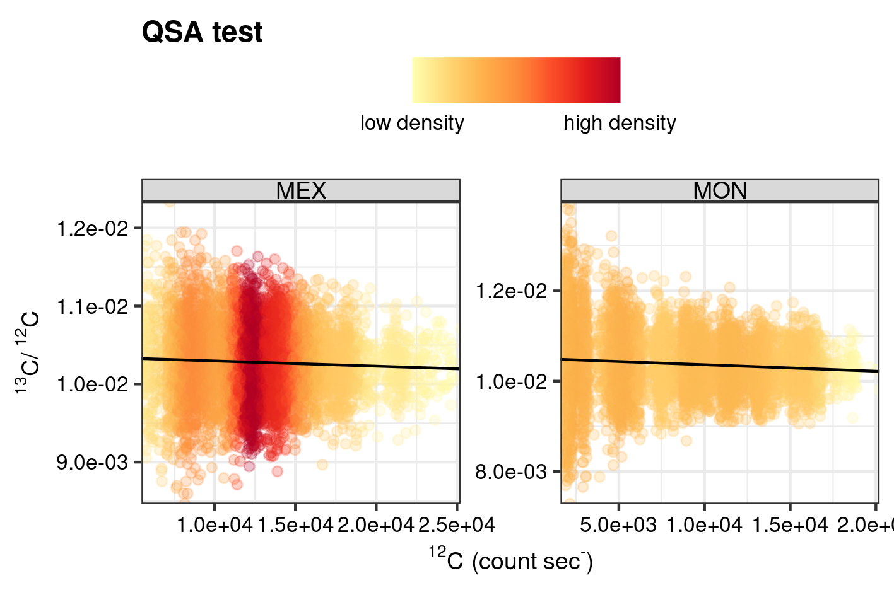

```{r, include = FALSE}
knitr::opts_chunk$set(
  collapse = TRUE,
  comment = "#>",
  eval = FALSE
)
```


# Introduction

This vignette deals with the evaluation of the impact of systematic and random biases on high-precision isotope data generated with the nanoSIMS 50L, and as discussed in the Supplementary Information of the paper (Supplementary Section 2.1 *Precision of isotope analysis* and Supplementary Section 2.3 *Quasi simultaneous Arrival*). The here discussed analytical artefacts all have been argued to compromise SIMS isotope analyses and do not relate to the isotope homogeneity of the analyte (i.e., the target of this study).


```{r setup, eval = TRUE}
library(point) # regression diagnostics
library(pointapply) # load package
```


# Download data

The assessment of these analytical artefacts  is largely based on the *point* R package. Information on how to generate processed data from raw data can be found in the vignette *Reading matlab files* (`vignette("data")`). Alternatively, processed data can be downloaded from [Zenodo](https://doi.org/10.5281/zenodo.4564170) with the function `download_point()`. Simulated data (*Sensitivity by simulation* (`vignette("simulation")`) is used to gauge the effectiveness of precision metrics (such as, the error of the mean) of an SIMS isotope analysis in detecting isotopically anomalies entrained in the analyte (intra-isotope variability).


```{r data}
# use download_point() to obtain processed data (only has to be done once)
download_point(type = "processed")
```


# Load data

For this example processed "real" data is loaded with a grid-cell size of 64 pixels by 64 pixels (100$\,\mu$m^2). Simulated data processed with Cook's D regression diagnostics is used to compare the here developed intra-isotope test statistic with precision metrics.


```{r }
# load "real" data
load_point("map_sum_grid", c("MEX", "MON"), grid_cell = 64, return_name = FALSE)
# load simulated data
load_point("simu", "CD_eval_intra", NULL, return_name = FALSE)
```


# Systematic biases

## Quasi simultaneous Arrival (QSA)

The combination of measuring under high ionisation efficiencies and the usage of electron multipliers (EM) for ion detection can lead to an artefact understood as the more-or-less (quasi) simultaneous arrival (QSA) of an incident ion at the detection device. Differentiation of the two secondary ions is thus not possible, and the ions are therefore counted as $1$ detection event by the machine. In the case of isotope systems this could theoretically lead to under-sampling of the common isotope [@Slodzian2004]. An exact correction of under-sampling induced by QSA can be a cumbersome undertaking, as such the R package `point` [@point] has a diagnostic tool that helps evaluate whether the ion count data is likely to have been compromised by this analytical artefact. The function `QSA_test()` fits a least-square linear model to the common isotope count rates (e.g. ^12^C) as a predictor, and the targeted isotope ratio (e.g. ^13^C/^12^C) as the independent variable. If under-sampling would be present in the ion count data, then this would cause a significant positive linear trend of higher isotope ratios with higher count rates of the common isotope.


```{r QSA}
# bind data frames
tb <- dplyr::bind_rows(map_sum_grid_64_MEX$depth, map_sum_grid_64_MON$depth)
# QSA test
test_QSA_64_all <- point::QSA_test(tb, "13C", "12C", file.nm, sample.nm, 
                                   grid.nm, .nest = grid.nm)
# make mlm model line
test_QSA_64_all <- dplyr::mutate(
  test_QSA_64_all, 
  hat_R = alpha_Xt.pr.12C + beta_Xt.pr.12C * Xt.pr.12C
  )
```


The function `gg_dens` provided in this package is used to visualise the high density data.


```{r}
# labels for ion count rates
xlab <- substitute(
  a ~ "(count sec"^"-"*")", 
  list(a = point::ion_labeller("12C", "expr"))
  )

# plot
QSA_dens <- gg_dens(
  test_QSA_64_all, 
  Xt.pr.12C,
  R_Xt.pr, 
  xlab, 
  point::R_labeller("13C", "12C", "expr"), 
  "QSA test",
  1,
  gr = sample.nm,
  unit = "dim",
  facet_sc = "free"
  )

# add lm line
QSA_dens + ggplot2::geom_line(ggplot2::aes(y = hat_R)) 

# save data
write_point("test_QSA_64_all")
 
# save plot  
save_point("point_QSA", ggplot2::last_plot(), width = 12, height = 8, 
           unit = "cm")
```


```{r echo=FALSE, eval=TRUE, fig.cap="QSA test.", out.width="80%"}
 
```


# Random bias

The random nature of secondary ions emitted from an analytical substrate (e.g. rock sample) during sputtering can be described by Poisson statistics, which can be used to predict the precision of pulsed ion counts (e.g. measurements with a *Cameca NanoSIMS 50L*) under ideal circumstances. More specifically, the variation can be deduced from the total counts of secondary ions. Usefully, we can compare these predictive values with the descriptive statistics; essentially estimates of the true population location (e.g. mean) and spread (variance).

First we will calculate some standard predictive and descriptive statistics for the internal precision of SIMS single iona, with the `point` function `stat_X()`. See the documentation of this package `vignette("IC-precision", package = "point")` for an extensive overview of the complete functionality of these functions as well as the mathematics behind the statistics.


```{r statXt}
# single ion statistics
stat_X_64_all <- purrr::map_dfr(
  purrr::flatten(list(map_sum_grid_64_MEX, map_sum_grid_64_MON)),
  ~stat_X(.x, file.nm, sample.nm, dim_name.nm, grid.nm)
  )
write_point("stat_X_64_all")
head(stat_X_64_all)
```


The same can be done for the statistics of isotope analysis with appropriate error propagation with the function `stat_R()`.


```{r statR}
# single ion statistics
stat_R_64_all <- purrr::map_dfr(
  purrr::flatten(list(map_sum_grid_64_MEX, map_sum_grid_64_MON)),
  ~stat_R(.x, "13C", "12C", file.nm, sample.nm, dim_name.nm, grid.nm)
  )
write_point("stat_R_64_all")
head(stat_R_64_all)
```


The reduced $\chi^2$ can then be used to assess the machine performance and analyte homogeneity as it cross-validates the observed error estimate with the theoretical Poisson-based precision. For example, the reduced $\chi^2$ of an isotope ratio equates to:

\begin{equation}
  \chi^2 = \left( \frac{s_{\bar{R}}} {\hat{s}_{\bar{R}}} \right)^2   
\end{equation}

where values close to $1$ suggest good agreement between the actual measurement and the predicted value [@Kilburn2015a]. Values lower than $1$ suggest that the analysis was better than predicted, and values higher than $1$ indicate that the analysis was worse than predicted by Poisson statistics.

Intra-isotope variation is measured by the test (based on F-statistic) as outlined in the paper. Varying degrees of variance in the ionization efficiency of the analyte cause a systematic trend that is mirrored in both isotopes. This ionization efficiency trend has been parameterized as the difference between the relative standard deviation of the common isotope $\epsilon_{X^{a}}$ and the theoretical standard deviation $\hat{\epsilon}_{N^{a}}$, based on Poisson statistics (so-called "excess" ionization, see paper). This ionization efficiency trend has an impact on the accuracy of the intra-isotope test (see paper), and therefore has been included in the simulated data. For this comparative approach an excess ionization of below < 6% has been omitted, because of limited detection at the lower ranges of ionization efficiency. The remainder has been divided into three groups; low (5--15%), medium (15--25%) and high (25--35%) excess ionization with the `ggplot::cut_width()` function [@ggplot2; @ggplot22016].


```{r cut}
# filter and cut continuous ionization efficiency
simu_CD_eval_intra <- simu_CD_eval_intra %>% 
 mutate(ion_trend = RS_Xt.sm.12C - hat_RS_Xt.sm.12C) %>% 
 filter(ion_trend > 6) %>% 
  mutate(ion_trend =
           factor(
             ggplot2::cut_width(ion_trend, 10),
             labels = c("low", "medium", "high")
           ))
# down-sample
simu_CD_eval_intra <- slice_sample(simu_CD_eval_intra, prop = 0.01)
```
  
  
A simple ggplot (`ggplot() + geom_point()`) [@ggplot2; @ggplot22016] has been used to compare the $F$ statistic for intra-isotope variability with the reduced $\chi^2$ for an assessment of the precision.

  
```{r FvsChi}
# plot F vs Chi2
ggplot(simu_CD_eval_intra, aes(x = chi2_R_Xt.sm, y = F_vl, color = force.nm)) +
  geom_point() +
  facet_grid(cols = vars(type.nm), rows = vars(ion_trend)) +
  scale_color_distiller(
    expression("isotope variation in substrate ("* Delta[B - A] *" \u2030 )"),
    palette = "YlOrRd"
    ) +
  scale_y_continuous(
    expression(F["(2),(n-3)"]),
    expand = c(0, 0),
    breaks = scales::pretty_breaks(4),
    ) +
  scale_x_continuous(
    expression(chi^2),
    expand = c(0, 0),
    breaks = scales::pretty_breaks(4),
    ) +
  ggtitle("Precision vs. accuracy") +
  themes_IC(base = ggplot2::theme_bw()) 

# save 
save_point("simu_precision", ggplot2::last_plot(), width = 14, height = 14, 
           unit = "cm")
```


```{r echo=FALSE, eval=TRUE, fig.cap="The sensitivity of precision and accuracy-based test statistics to intra-isotope variability.", out.width="80%"}
 knitr::include_graphics("figures/simu_precision.png")
```


# References
