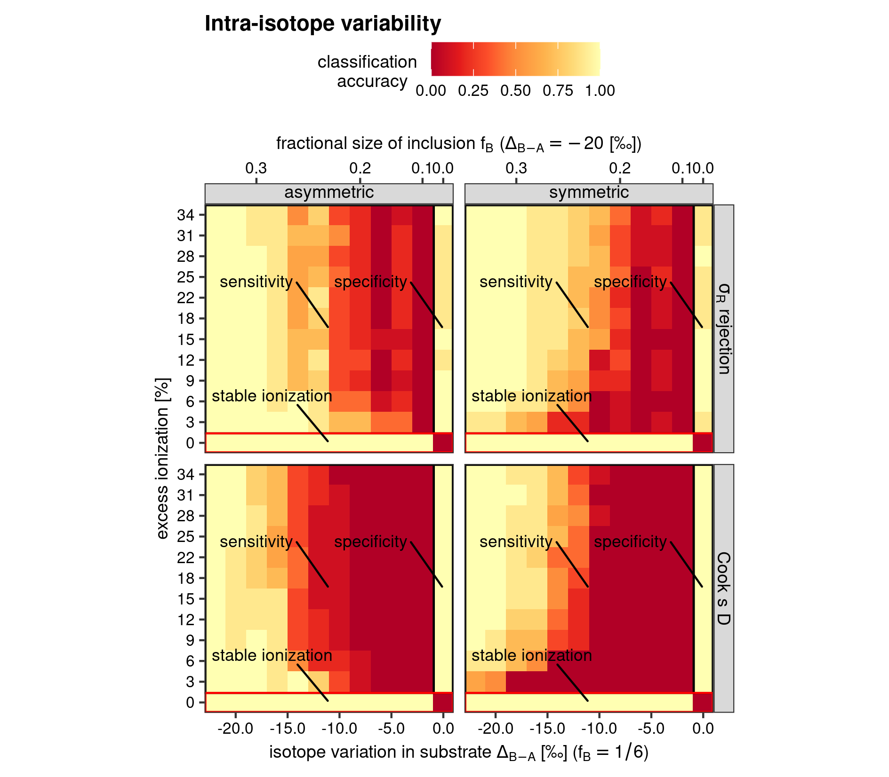
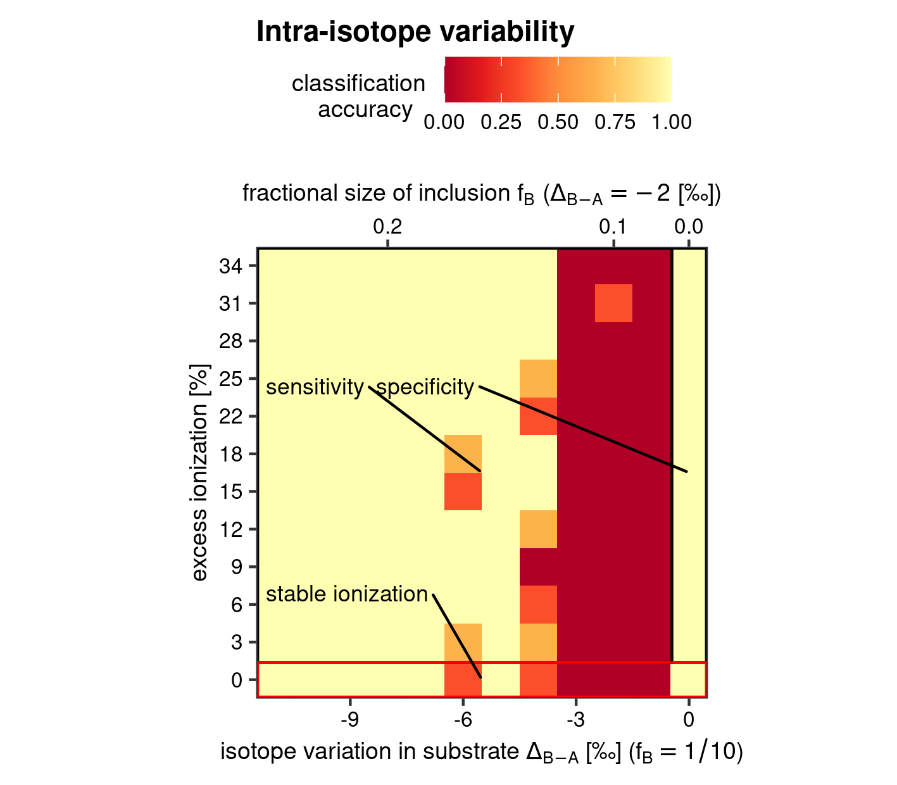

```{r, include = FALSE}
knitr::opts_chunk$set(
  collapse = TRUE,
  comment = "#>",
  eval=FALSE
  )
```


The R package `pointapply` contains the code and data to reconstruct the publication: Martin Schobben, Michiel Kienhuis, and Lubos Polerecky. 2021. *New methods to detect isotopic heterogeneity with Secondary Ion Mass Spectrometry*, preprint on [Eartharxiv](https://eartharxiv.org/).


# Introduction 

This vignette provides the details on how to assess the performance of the intra- and inter-isotope variability tests of the paper with synthetic ion count data. The details on the procedure of generating synthetic ion counts can be found in the vignette *Sensitivity by simulation* (`vignette("simulation")`).

The following packages are required for the evaluation of model performance.


```{r setup, eval=TRUE}
library(point) # regression diagnostics
library(pointapply) # load package
```


The `point` package [@point] is required to calculate the "excess ionization trend". as parametrised by the difference between the relative standard deviation of the common isotope $\epsilon_{X^{a}}$ and the theoretical standard deviation $\hat{\epsilon}_{N^{a}}$ (Section 2 of the paper). 

This vignette of the`pointapply` package showcases how the Figures 4 and 5 were created.


```{r bld, echo=FALSE, eval=TRUE}
on_build <- FALSE
```  


# Download data

The simulated data can be generated by running the code of the vignette *Sensitivity by simulation* (`vignette("simulation")`). Alternatively, processed data can be downloaded from [Zenodo](https://doi.org/10.5281/zenodo.4564170) with the function `download_point()`. 


```{r data}
# use download_point() to obtain processed data (only has to be done once)
# download_point(type = "processed")
```


# Load data

The synthetic data can loaded with `load_point()`


```{r loadsimu}
# load simulated data (intra-isotope variability)
load_point("simu", "sens_IC_intra", NULL, return_name = FALSE, on_build)
# load test statistics (intra-isotope variability)
load_point("simu", "CD_eval_intra", NULL, return_name = FALSE, on_build)
load_point("simu", "CM_eval_intra", NULL, return_name = FALSE, on_build)
# distinct observations
simu_CD_eval_intra <- dplyr::distinct(simu_CD_eval_intra, M_R_Xt.sm, 
                                      .keep_all = TRUE)
# load test statistics (inter-isotope variability)
simu_inter <- load_point("simu", paste0("eval_inter_", 1:10), NULL, 
                         return_name = TRUE, on_build)
```


# Evaluate model performance

## Accuracy

Accuracy is on of the main metrics to evaluate a model performance, which refers there to the intra-isotope variability test and the inter-isotope variability test (Section 4 of the paper). Accuracy of model classification is then the ability to correctly predicts whether an analyte is isotopically homogeneous or heterogeneous, where the homogeneous model is defined as: 

$$\hat{X}_i^b = \hat{R}X_i^a +  \hat{e}_i \text{.}$$

As we know the initial conditions of the synthetic data (i.e. whether the virtual analyte is isotopically homogeneous or heterogeneous), we can then assess whether the test statistic was correct. In the case of an virtual isotopically heterogeneous analyte we expect therefore that the p value is low. As we have selected a confidence level of 99.9%, a $p$ value of lower than 0.001 would lead to the rejection of the $H_0$ of the ideal lineal R model, and the alternative hypothesis of a isotopically heterogeneous analyte is more appropriate for the sample. This would be a True Positive (TP). On the other hand, if the p value would be higher than 0.001, but we know that the synthetic data is isotopically heterogeneous, than we deal with a False Negative (FN). Reversely, when we consider the isotopically homogeneous synthesized dataset, we would like to see that the model classification is specific enough to identify that as well with the test statistic, and thus a p-value higher than 0.001, or a so-called True Negative (TN). If for some reason the test statistic drops below 0.001, even though we really have an isotopically homogeneous analyte, than there might be a problem with the test, and we deal with something known as a False Negative (FN) result. Rephrased, the latter case, would lead us to conclude that the material is isotopically heterogeneous, whereas this is really not the case.

The synthesised data include 10 repetitions for each of the set of variable combinations (which helps to understand the sensistivty of the here-supplied test statistics); see the vignette *Sensitivity by simulation* (`vignette("simulation")`), for both the intra- and inter-isotope variability test.  This provides the opportunity to formalise a classification accuracy as:

$$\text{accuracy} = \frac{\text{Treu Positive (TP)}\, + \,\text{Treu Negative (TN)}}{\text{total}} \, \text{,}$$

as also shown in the paper. To apply this to our synthesised dataset we use the function `acc_fun()` provides in the `pointapply` package within a `summarise()` call from the `dplyr` package [@dplyr], and where the data is first grouped (with `dplyr::group_by()`) according to before mentioned variable combinations.


```{r transintra}
# bind the two diagnostic treatments of simulated ion (Cameca and Cooks D)
tb_eval  <- list(simu_CM_eval_intra, simu_CD_eval_intra) %>%  
  purrr::set_names(nm = c("Cameca", "Cook's D")) %>% 
  dplyr::bind_rows(.id = "stat.nm") 
  
# calculate accuracy of model classification
tb_intra <-  dplyr::group_by(tb_eval, stat.nm, type.nm, trend.nm, force.nm) %>% 
  dplyr::summarise(
    accuracy = acc_fun(unique(force.nm), p_F, ntot = n()), 
    .groups = "drop"
    )
```


In addition, the sensitivity range for ionization efficiency trend is converted to the excess ionization efficiency, which is used as the quantitative measure of this analytical factor throughout the paper. For this we need to subtract the relative standard deviation of the common isotope $\epsilon_{X^{a}}$ from the theoretical standard deviation $\hat{\epsilon}_{N^{a}}$ (Section 4.1 and Supplementary Section 2.1 of the paper), and this can be easily done with the `stat_Xt()` function of the `point` package. Here, we set the argument `.stat` to `c("RS", "hat_RS")` to only return the  $\epsilon_{X^{a}}$ and $\hat{\epsilon}_{N^{a}}$, respectively.


The model classification accuracy has been further split into model sensitivity, which is the sensitivity of the model in regards of detecting an isotopically heterogeneous analyte, expressed as;

$$\text{Sensitivity} = \frac{\text{TP}}{\text{TP}+\text{FN}}$$

And, model specificity, which gauges how well the model detects non-events (i.e. an isotopically homogeneous analyte), and can be expressed as; 

$$\text{Specificity} = \frac{\text{TN}}{\text{TN}+\text{FP}}\text{.}$$

This procedure highlights once more that the $\sigma_R$-rejection might lead to wrong conclusions if not considered properly. And thus even though a slightly lower sensitivity, the Cook's D method is the preferred outlier detection method (see paper and figure below).


```{r}
# statistics on the single common isotope
tb_X <- point::stat_X(
  simu_sens_IC_intra, 
  trend.nm, 
  .N = N.sm, 
  .X = Xt.sm, 
  .stat = c("RS", "hat_RS")
  ) %>% 
  dplyr::filter(species.nm == "12C")

# named vector
vc_RS <- purrr::set_names(
  tb_X$trend.nm,  
  nm = sprintf("%.0f", tb_X$RS_Xt.sm - tb_X$hat_RS_N.sm)
  )
```


```{r rename, echo=FALSE}
# rename methods, make nice labels
tb_intra <- dplyr::mutate(
    tb_intra, 
    stat.nm = 
      factor(
        stat.nm, 
        levels = c("Cameca", "Cook's D"), 
        labels = c(sigma[R]~"rejection", "Cook~s~D")
        )
    )
```


## Visualise intra-isotope variability test accuracy 

The model classification accuracy for all possible combinations of the two continuous variables; excess ionization efficiency and intra-isotopic variability, can be visualised in a heatmap. A heatmap can depict the classification accuracy as a change in color hue or intensity over two dimensions, and the function `heatmap()` has been created to simplify this operation. The arguments `grp1` and `grp2`, furthermore, allow the addition of two nominal factorial factor of the sensitivity experiment; the outlier detection method (Cook's D and $\sigma_R$-rejection methods) and the two extreme end-member scenarios for intra-isotope variation ("symmetric" and "asymmetric", see vignette *Sensitivity by simulation*; `vignette("simulation")`). This essentially adds a `ggplot::facet_grid()`[@ggplot2; @ggplot22016] call with `cols` and `rows` arguments connected two the nominal factorials.


```{r intraheat}
# heatmap intra-isotope variability test
heat_map(
  tb_intra,
  x = force.nm, 
  y = trend.nm,
  stat = accuracy,
  grp1 = stat.nm,
  grp2 = type.nm,
  conversion = vc_RS,
  ttl = "Intra-isotope variability",
  x_lab = expression(
    "isotope variation in substrate "*Delta[B - A] *" [\u2030] ("*f[B] == 1/6*")"
    ),
  y_lab = "excess ionization [%]",
  x_sec = expression(
    "fractional size of inclusion "*f[B]~"("*Delta[B - A] == -20 ~ "[\u2030])"
    )
  )

# save 
save_point("heat_sens_intra", ggplot2::last_plot(), width = 16, height = 14, 
           unit = "cm", on_build)
```


```{r echo=FALSE, eval=TRUE, fig.cap="Heatmap for model classification accuracy of the intra-isotope variability test", out.width="80%"}
 
```


## Accuracy of the inter-isotope variability test

The accuracy of the inter-isotope variability test does not significantly differ from the procedure outlined for the intra-isotope variability test. Because of the large computational demands of this synthetic dataset, the performance metric were broken up into 10 pieces. The following code assembles them again into one data frame.


```{r loadinter}
# combine datasets
eval_inter <- purrr::map_dfr(rlang::syms(simu_inter), eval)
```


Data transformation and model classification accuracy calculations for inter-variability are then much the same as before.


```{r transinter}
# calculate accuracy of model classification
tb_inter <- dplyr::group_by(eval_inter, trend.nm, execution, type.nm, anomaly.nm) %>% 
  dplyr::summarise(
    accuracy = acc_fun(unique(anomaly.nm), p_inter, ntot = n()), 
    .groups = "drop"
    ) 
```


Similar is also the call for plotting, which consists again of a heatmap, but now without the additional plot panels, as there are no additional nominal factors to test for. The only difference is the addition of a secondary axis which again is used to exemplify the sensitivity of the test statistic to isotopic perturbation as a fractional size difference (so, whilst fixing the isotopic composition of the anomalous analyses within the whole set analyses)


```{r interheatmap}
# heatmap inter-isotope variability test
hmap2 <- heat_map(
  tb_inter,
  x = anomaly.nm, 
  y = trend.nm,
  stat = accuracy,
  grp1 = NULL,
  grp2 = NULL,
  conversion = vc_RS,
  ttl = "Intra-isotope variability",
  x_lab = expression(
    "isotope variation in substrate "*Delta[B - A] *" [\u2030] ("*f[B] == 1/10*")"
    ),
  y_lab = "excess ionization [%]",
  x_sec = expression(
    "fractional size of inclusion "*f[B]~"("*Delta[B - A] == -2 ~ "[\u2030])"
    )
  )

# save and print
save_point("heat_sens_inter", hmap2, width = 12, height = 10.5, unit = "cm", 
           on_build)
```


```{r echo=FALSE, eval=TRUE, fig.cap="Heatmap for model classification accuracy of the inter-isotope variability test", out.width="80%"}
 
```


# References
