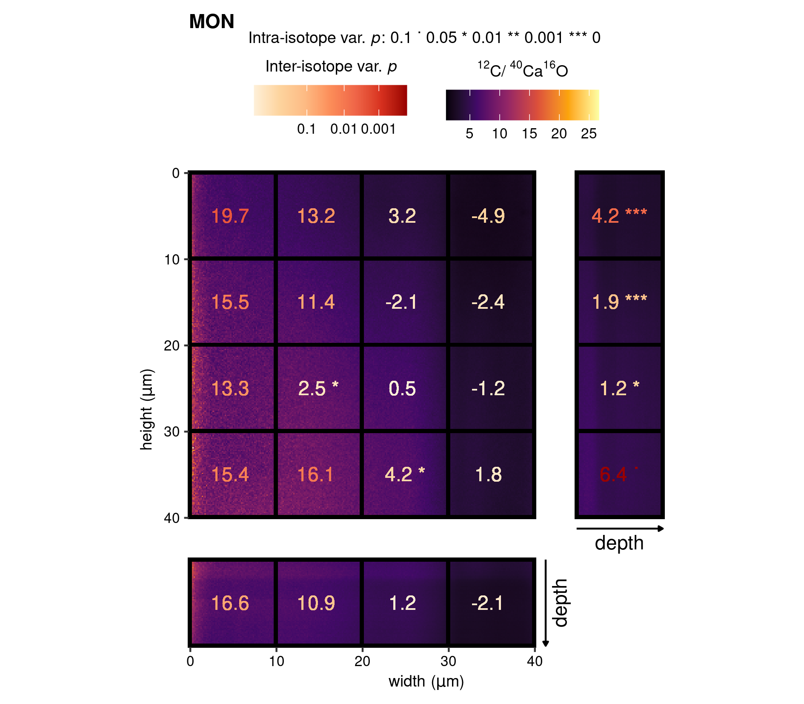
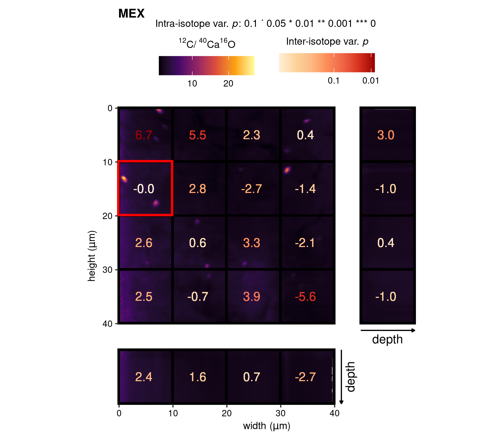
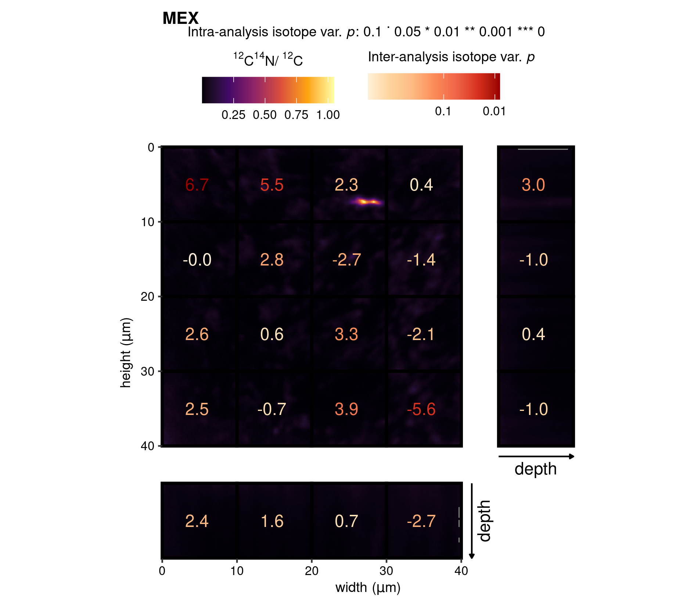
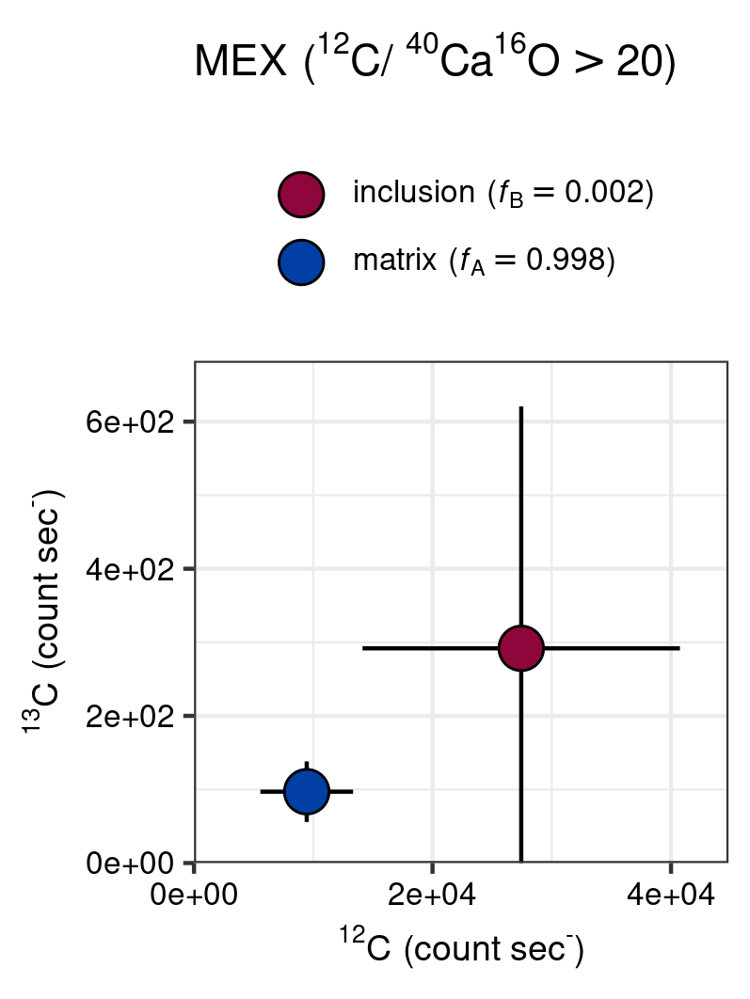
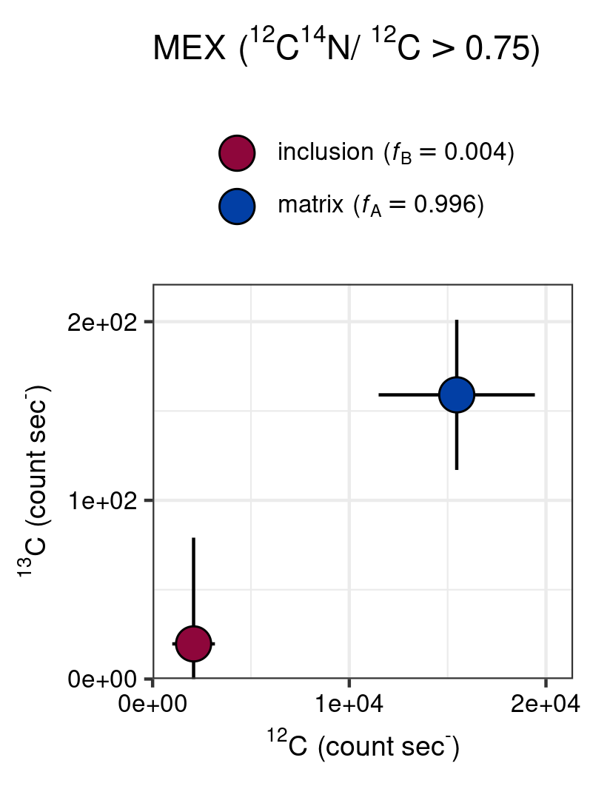

```{r, include = FALSE}
knitr::opts_chunk$set(
  collapse = TRUE,
  comment = "#>",
  eval = FALSE
)
```


# Introduction

This vignette deals with the visualization of spatial ion maps and high-precision isotope data generated with the Cameca nanoSIMS 50L, as discussed in the paper (Figs 6 and 7, and Supplementary Fig. 7). 


```{r setup, eval = TRUE}
library(point) # regression diagnostics
library(pointapply) # load package
```


# Download data

Ion count data processed with the `*`point`*` R package [@point] is required to produce the raster plots (Figs 7 and 8, and Supplementary Fig. 7). Information on how to generate processed data from raw data can be found in the vignette *Reading matlab files* (`vignette("data")`). Alternatively, processed data can be downloaded from [Zenodo](https://doi.org/10.5281/zenodo.4580159) with the function `download_point()`. 


```{r data, eval=FALSE}
# use download_point() to obtain processed data.
# this only has to be done once after installation
download_point(type = "processed")
```


# Load data

For this example aggregated and processed ion count data is loaded with grid-cell sizes of 64 pixels by 64 pixels, which as determined based on regression diagnostics yields the most accurate isotope ratio *Validation of regression assumptions* (`vignette("regression")`). In addition, ion ratio maps, which provide auxiliary information on the spatial distributions of e.g. organic inclusions, and two full (pixel-by-pixel) grid-cell datasets for the MEX analyte are loaded.


```{r load}
# load e.g. grid aggregated counts
load_point("map_sum_grid", "MEX", 64) 
```


# Raster images
## Simple ion ratio map

The function `gg_cnts()` is designed for plotting of ion count ratios, i.e. the background ion map of Figures 7 and 8 and Supplementary Figure 7. This function simply produces a raster of ion count ratios according to spatial dimensions; height, width and depth, by using `ggplot() +  geom_raster()`[@ggplot2; @ggplot22016], and mapping a colour to the numeric value of the ion ratio. The viridis colour scale is used as it provides a perceptually uniform scale in both colour and black-and-white (`scale_fill_viridis_c()`).


```{r raster, eval = TRUE}
gg_cnts("MEX", "12C14N", "12C", viri = "D")
```


## Combination plot

The regression diagnostics (Cook's D) for ^13^C/^12^C are calculated over the data-grid with a 100$\,\mu$m^2 (64 pixels by 64 pixels) size, as this aggregation resulted in normally distributed ion counts; see *Validation of regression assumptions* (`vignette("assumptions")`), and, as described in the paper. The core `point`[@point] functions `diag_R()` and `eval_diag()` are subsequently applied to the gridded data-sets to assess the intra- and inter-analysis ^13^C/^12^C variability comprised in, respectively, the individual grid-cells and the whole target area of the analyte.


```{r diag1}
# load point
library(point)

# diagnostics
diag_R(
  map_sum_grid_64_MON, 
  "13C", 
  "12C", 
  dim_name.nm, 
  sample.nm, 
  file.nm, 
  grid.nm, 
  .nest = grid.nm, 
  .output = "complete", 
  .meta = TRUE
)
```


The results can be visualized by application of the function `gg_effect()`, which combines the previous `gg_cnts()` function with tiles (`geom_tiles()`) and text (`geom_text()`)[@ggplot2; @ggplot22016] mapping the outcomes of regression diagnostic on ^13^C/^12^C. This produces the Figures 7 and 8, and Supplementary Figure 7 of the paper. 

### Figure 7 (MON)

In the first example (Fig. 7), high-precision grid-cells for ^13^C/^12^C is combined with a high spatial resolution map for `r point::R_labeller("12C", "40Ca16O")`. Although no pattern can be discerned in the ion ratio map, the high-precision ^13^C/^12^C reveal a distinct gradient traversing the targeted analyte, which is reflected in both the intra- and inter-isotope variability (as designated by significance stars and colour of the text, respectively).


```{r grid1}
# combination plot
gg_effect("MON", "12C-40Ca16O", viri = "B", save = TRUE)
```


```{r echo=FALSE, eval=TRUE, fig.cap=paste0("Raster (", point::R_labeller("12C", "40Ca16O"), ")--grid-cell combination plot (MON)."), out.width="80%"}

```


### Figure 8 (MEX)

The same procedure is repeated for the MEX analyte, starting by performing the intra- and inter- analysis isotope test of the `point` package.


```{r diag2}
# diagnostics
diag_R(
  map_sum_grid_64_MEX, 
  "13C", 
  "12C", 
  dim_name.nm, 
  sample.nm, 
  file.nm, 
  grid.nm, 
  .nest = grid.nm, 
  .output = "complete", 
  .meta = TRUE
)
```


Thereafter, the ion ratio map (`r point::R_labeller("12C", "40Ca16O")`) is combined with high ^13^C/^12^C tiles for the 100$\,\mu$m^2 grid-cells. For this analyte, however, there appear to be distinct cluster of elevated `r point::R_labeller("12C", "40Ca16O")` (e.g. red rectangle), which could indicate the presence of organic inclusions in the sedimentary carbonate. 


```{r grid2}
# combination plot
gg_effect("MEX", "12C-40Ca16O", viri = "B", save = TRUE)
```


```{r echo=FALSE, eval=TRUE, fig.cap=paste0("Raster (", point::R_labeller("12C", "40Ca16O"), ")--grid-cell combination plot (MEX)."), out.width="80%"}

```


### Supplementary Figure 7 (MEX)


The same procedure for MEX is repeated, but then with `r point::R_labeller("12C14N", "12C")` as a background raster image. This revealed additional spatial patterns related to nitrogen enrichment. Notably, the grid-cell highlighted with the red rectangle.


```{r}
gg_effect("MEX", "12C14N-12C", viri = "B", save = TRUE)
```


```{r echo=FALSE, eval=TRUE, fig.cap=paste0("Raster (", point::R_labeller("12C14N", "12C"), ")--grid-cell combination plot (MEX)."), out.width="80%"}

```


## In-depth analysis of MEX

The recognition of clusters of elevated `r point::R_labeller("12C14N", "12C")` and `r point::R_labeller("12C", "40Ca16O")` in the MEX analyte spurred additional in-depth analysis on the potential effect of these anomalies regions on the ^13^C/^12^C values. For this purpose, the auxiliary information of the ion raster images are used to filter those anomalous areas (organic and nitrogen enriched areas) from the background, and analyse those regions in term of ^13^C/^12^C composition. The `gg_point()` is designed to perform this function, where the arguments `image` and `ion_1_thr` and `ion_1_thr` refer to ion ratio map and the respective ions, and the argument `thr` is used to set a threshold value for filtering. The arguments `ion_1_R` and `ion_1_R` connect the former to high-precision isotope analysis (e.g. ^13^C/^12^C) which are included in the full (pixel by pixel dataset) provided with the argument `IC`.


### Figure 8

This function has been applied to `r point::R_labeller("12C", "40Ca16O")` of Figure 7 (highlighted by a red rectangle). This shows that the ^13^C and ^12^C count rates could be of potential high influence on the isotope ratio, given that the organic inclusion is sufficiently large relative to the matrix (or the analytical resolution of the method is sufficiently large).


```{r inclusion1}
gg_point(
  title = "MEX",
  grid_cell = 2,
  # ion ratio for filtering
  ion1_thr = "12C",  
  ion2_thr = "40Ca16O", 
  thr = 20, 
  # isotope ratio
  ion1_R = "13C", 
  ion2_R = "12C" 
)
# save
save_point("point_MEX_ROI9", ggplot2::last_plot(), width = 6.75, height = 9, 
           unit = "cm")
```


```{r echo=FALSE, eval=TRUE, fig.cap=paste0("In-depth analysis of the potential influence of anomolous ", point::R_labeller("12C", "40Ca16O"), " values on the ",  point::R_labeller("13C", "12C")," (MEX)."), out.width="50%"}

```


### Supplementary Figure 8


The in-depth analysis of the nitrogen enriched region on Supplementary Figure 8 (red rectangle) seems to show a similar pattern, where the enriched cluster falls in a distinct regions of the Cartesian coordinates. Although in this case the enriched `r point::R_labeller("12C14N", "12C")` have distinctly lower count rates when compared to background values.


```{r inclusion2}
gg_point(
  IC = map_full_grid_64_MEX$map_full_grid_64_9_MEX, 
  image = map_raster_image_MEX$depth, 
  ion1_thr = "12C14N", ion2_thr = "12C", thr = 0.75, 
  ion1_R = "13C",  ion2_R = "12C"
  ) 
# save
save_point("point_MEX_ROI2", ggplot2::last_plot(), width = 6.75, height = 9, 
           unit = "cm")
```


```{r echo=FALSE, eval=TRUE, fig.cap=paste0("In-depth analysis of the potential influence of anomolous ", point::R_labeller("12C14N", "12C"), " values on the ",  point::R_labeller("13C", "12C")," (MEX)."), out.width="50%"}

```


# References
