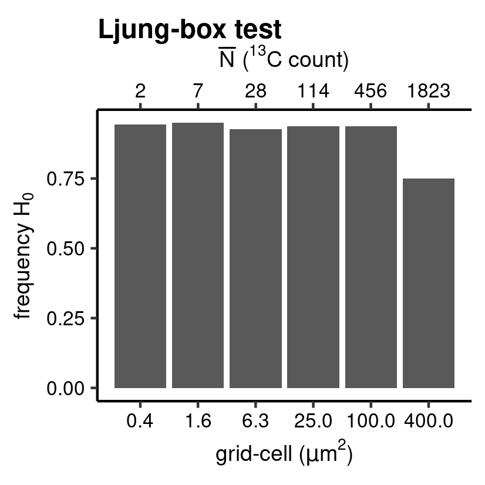
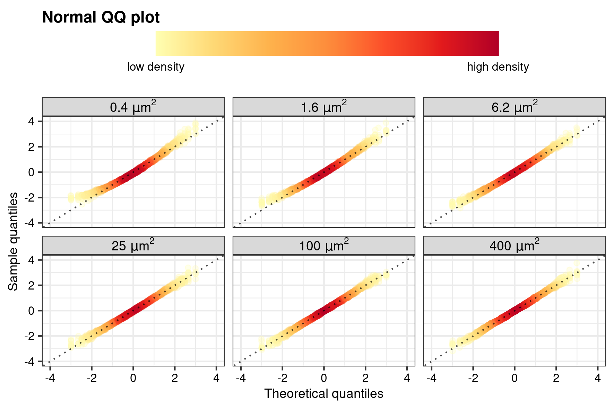
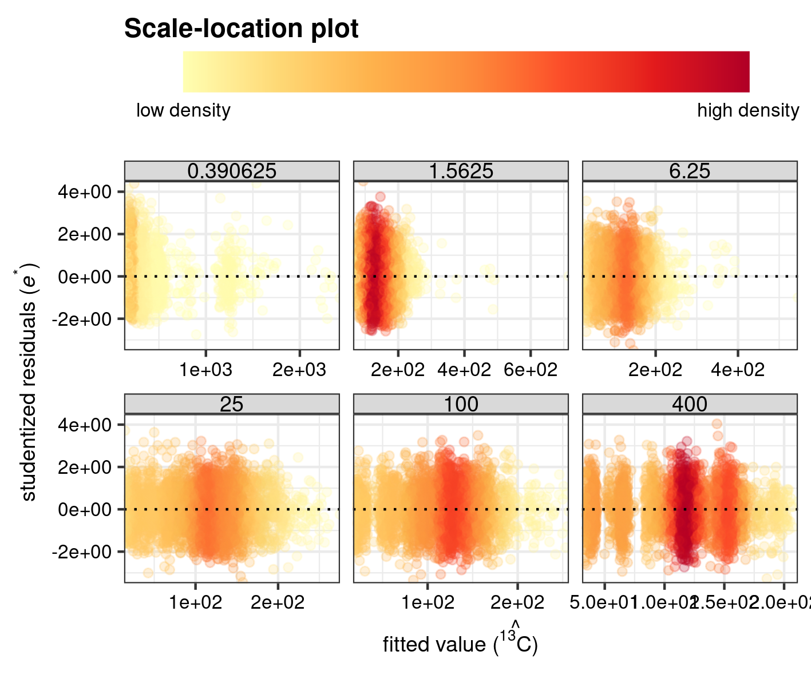

```{r, include = FALSE}
knitr::opts_chunk$set(
  collapse = TRUE,
  comment = "#>",
  eval = FALSE
)
```


The R package `pointapply` contains the code and data to reconstruct the publication: Martin Schobben, Michiel Kienhuis, and Lubos Polerecky. 2021. *New methods to detect isotopic heterogeneity with Secondary Ion Mass Spectrometry*, preprint on [Eartharxiv](https://eartharxiv.org/).


# Introduction

The validity of inter- and intra-analysis isotope models is verified for the nanoSIMS-generated data by an assessment of the implicit assumptions of the linear regression model (Eq. (4) of the paper, and see below); normality, homogeneity and independence of residuals (see also `vignette("IC-diagnostics", package = "point")`). 

$$\text{The ideal linear model:} \quad \hat{X}_i^b = \hat{R}X_i^a +  \hat{e}_i \text{.}$$


In addition, the regression assumptions are used to aid the selection of the appropriate grid-cell size, as the underlying data structure of ion counts depends on this factor encompassed in the individual measurements of a conventional SIMS isotope analysis. In effect, the smaller the grid-cell (i.e. measurement time) the more the reduced counts will deviate from a normal (Gaussian distribution). This effect will affect at first counts of the rare isotope (i.e. ^13^C). 

The function to perform regression diagnostics `diag_R()` is a core feature of the accompanying package `point` [@point].


```{r setup, eval=TRUE}
library(point) # regression diagnostics
library(pointapply) # this paper
```


# Download data

The validation of regression assumptions of Supplementary Section requires ion count data processed with the *point* R package. Information on how to generate processed data from raw data can be found in the vignette *Reading matlab files* (`vignette("data")`). Alternatively, processed data can be downloaded from [Zenodo](https://doi.org/10.5281/zenodo.4564170) with the function `download_point()`. 


```{r data}
# use download_point() to obtain processed data (only has to be done once)
download_point(type = "processed")
```


# Load data

For this example processed data is loaded with different grid-cell sizes to gauge the effect of cell-size on the underlying data structure and its effect on the validity of the linear regression model. In the study grid-cell size of `r sapply(2:7, function(x) 2 ^ x)` pixels for one side of the square cell.


```{r }
library(purrr)
library(rlang)
library(dplyr)

# grid-cell sizes
grid_cell <- sapply(2:7, function(x) 2 ^ x)
# names of the analytes in the paper
name <- c("MEX", "MON")
# load
name <- load_point("map_sum_grid", name, grid_cell, return_name = TRUE)
# data frame aggregated over depth
tb <- map_dfr(syms(name), ~filter(eval(.x), .data$dim_name.nm == "depth"))
```


# Regression diagnostics

## Normality of residuals

The assumption of normality is tested on the studentized residuals ($\hat{e}_i^*$) of the ratio method regression model for ^12^C (independent) and ^13^C (dependent), see the paper and the documentation of the `point` package for more information. The `diag_R()` with the `.method = "QQ"` generates sample quantiles and theoretical quantiles (and the predicted quantiles together with a standard error) as well as performing an *Anderson-Darling* hypothesis test (by selecting: `.hyp = "norm"`) with the null hypothesis $H_0$ of normality for $\hat{e}_i^*$. 

Note that these analysis can take a while to execute, but the execution can be speed
up by parallel execution. This can be achieved by setting `.mc_cores` to a number that is available on your machine. This option is, however, not avalaible for Windows.


```{r QQ}
tb_QQ <- diag_R(tb, "13C", "12C", file.nm, sample.nm, grid_size.nm, grid.nm, 
                .method = "QQ", .hyp = "norm", .output = "diagnostics", 
                .mc_cores = 4)
```


## Residuals with a mean of zero 

For the next chunk of code, only the argument `.hyp` is changed to `"ttest"`. This invokes another hypothesis test, which checks whether the mean of the pooled $\hat{e}_i^*$ is significantly different from zero by performing a one-sample two-sided *Student’s t* hypothesis test. 


```{r mu}
tb_mu <- diag_R(tb, "13C", "12C", file.nm, sample.nm,  grid_size.nm, grid.nm, 
                .method = "QQ", .hyp = "ttest", .output = "diagnostics",
                .mc_cores = 4)
```


## Constant variance

Patterns in the homogeneity of $\hat{e}_i^*$ are another diagnostic feature for the validity of the regression model. The `diag_R()` function with argument  `.method = "CV"` provides the necessary building blocks for plotting a *scale-location* plot, where $\hat{e}_i^*$ is plotted against the predicted value (here $\hat{^{13}C}$) to visualise potential patterns that can help assess whether a linear model is the most accurate representation of the sampled data. This is formalized in yet another hypothesis test; *Breusch-Pagan* test (here set by the argument `.hyp = "bp"`), which essentially plots a least square model on this location-scale plot. Again, check the paper and the documentation of the `point` package for more information on the function.


```{r CV}
tb_CV <- diag_R(tb, "13C", "12C", file.nm, sample.nm, grid_size.nm, grid.nm, 
                .method = "CV", .hyp = "bp", .output = "diagnostics",
                .mc_cores = 4)
```


## Independence of residuals 

The independence of the distributions, or autocorrelation among measurements, is checked by calculating the correlation of the series of $\hat{e}_i^*$ with a time-lagged version of itself. This is done by setting the argument `.method` to `"IR"`. Also, this can be cast in a hypothesis test. The `diag_R()` function applies as a *Ljung-Box* hypothesis test, where the time series is cross-validated with a time series without autocorrelation ("white noise"); the later forms the basis for the $H_0$ of "no autocorrelation". 


```{r IR}
tb_IR <- diag_R(tb, "13C", "12C", file.nm, sample.nm, grid_size.nm, grid.nm, 
                .method = "IR", .hyp = "ljung", .output = "diagnostics",
                .mc_cores = 4)  
```


# Visualization
## Classification plots

Barplots (`ggplot` with `geom_bar()`[@ggplot2; @ggplot22016]) are chosen to visualise (Supplementary Fig. 6), and summarise the outcomes of the different hypothesis tests for the different grid-cell sizes. Besides a bin selection based on grid-cell size, a secondary x-axis is added to further emphasize the importance of count statistics (Poisson statistics) on the underlying data structure, and thus a crucial aspects in the outcome of various hypothesis tests. For this the mean count of the rare isotope (^13^C) is calculated for both samples added together and for each grid-cell size separately. 


```{r}
# mean ion counts for grid-cell sizes
vc_N_13C <- group_by(tb, grid_size.nm, species.nm) %>% 
  summarise(N = mean(N.pr), .groups = "drop") %>% 
  filter(species.nm == "13C")   
```


The function `hyp_class()` constructs barplots showing the frequency of $H_0$ rejection for the various hypothesis tests.


```{r QQclass}
QQ_class <- hyp_class(tb_QQ, vc_N_13C, "Normality test", save = TRUE) # barplot
```


```{r echo=FALSE, eval=TRUE, fig.cap="Anderson-Darling normality test.", out.width="50%"}
knitr::include_graphics("figures/bar_normality_test_class.png")
```


```{r CVclass}
CV_class <- hyp_class(tb_CV, vc_N_13C, "Breusch-Pagan test", save = TRUE) # barplot
```


```{r echo=FALSE, eval=TRUE, fig.cap="Breusch-Pagan test.", out.width="50%"}
knitr::include_graphics("figures/bar_breusch-pagan_test_class.png")
```


```{r muclass}
mu_class <- hyp_class(tb_mu, vc_N_13C, "Student's t test", save = TRUE) # barplot  
```


```{r echo=FALSE, eval=TRUE, fig.cap="Student's t test.", out.width="50%"}
knitr::include_graphics("figures/bar_student's_t_test_class.png")
```


```{r IRclass}
IR_class <- hyp_class(tb_IR, vc_N_13C, "Ljung-box test", save = TRUE)  # barplot
```


```{r echo=FALSE, eval=TRUE, fig.cap="Ljung-box test.", out.width="50%"}

```


```{r class, echo=FALSE}
# overview
p <- gridExtra::grid.arrange(
  gridExtra::arrangeGrob(QQ_class, CV_class, ncol = 2), 
  gridExtra::arrangeGrob(mu_class, IR_class, ncol = 2)
) 
png(filename = "figures/bar_over_class.png", width = 14, height = 14, 
    units = "cm", res = 256)
grid::grid.draw(p)
dev.off()
```


# Scatterplots

The results of the regression diagnostics are furthermore evaluated by visualising the normality of the pooled $\hat{e}_i^*$ as a *normal Quantile--Quantile plot* (Supplementary Fig. 4) and homogeneity of variance as a *scale-location* plot (Supplementary Fig. 5). Because of the high number of ion counts in a standard SIMS measurement, the 2D-density of the data (i.e. how many data point fall in a specific regions on the x-y coordinates of the plot) is highlighted by mapping of color and alpha to the individual points for a better visualization of patterns. This is achieved with the function `gg_dens()` which produces a `ggplot` [@ggplot2; @ggplot22016] with `geom_point()` and calculates the 2D density of each observation with the function `MASS::kde2d()`[@MASS; @MASS2002], and which is included in the function `point::twodens()`.


## Normal Quantile--Quantile plot


```{r QQdens}
library(ggplot2)

QQ_dens <- gg_dens(
  tb_QQ, 
  TQ,
  RQ, 
  "Theoretical quantiles", 
  "Sample quantiles", 
  "Normal QQ plot",
  grid_size.nm,
  1, 
  c(-4, 4), 
  c(-4, 4),
  unit = "um"
)  

# add abline
QQ_dens <- QQ_dens + geom_abline(alpha = 0.7, linetype = 3) 
# plot and save for paper
save_point(QQ_dens, name = "point_QQ", width = 15, height = 10, unit = "cm")
```


```{r echo=FALSE, eval=TRUE, fig.cap="Quantile--Quantile normality plot", out.width="75%"}

```


## Scale--location plot


```{r CVdens}
CV_dens <- gg_dens(
  tb_CV, 
  hat_Xt.pr.13C,
  studE, 
  substitute(
    "fitted value (" * hat(a) * ")", 
    list(a = point::ion_labeller("13C", "expr"))
    ), 
  expression("studentized residuals (" * italic(e)^"*" * ")"), 
  "Scale-location plot",
  grid_size.nm,
  1, 
  facet_sc = "free_x",
  unit = "um"
)
# add ab line
CV_dens <- CV_dens + geom_hline(yintercept = 0, linetype = 3)
# plot and save for paper
save_point(CV_dens, name = "point_CV", width = 15, height = 10, unit = "cm")
```


```{r echo=FALSE, eval=TRUE, fig.cap="Scale--location plot", out.width="75%"}
 
```

# References
