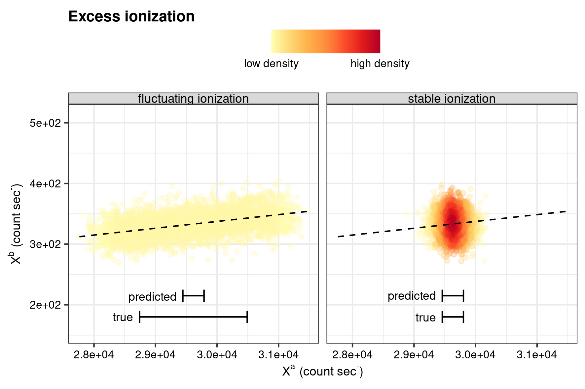
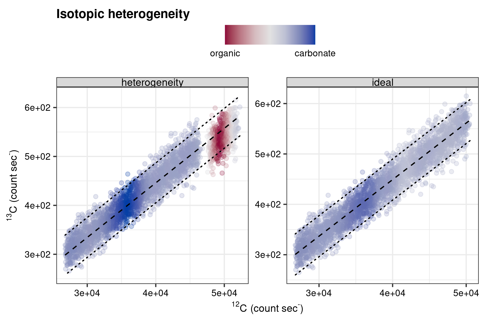
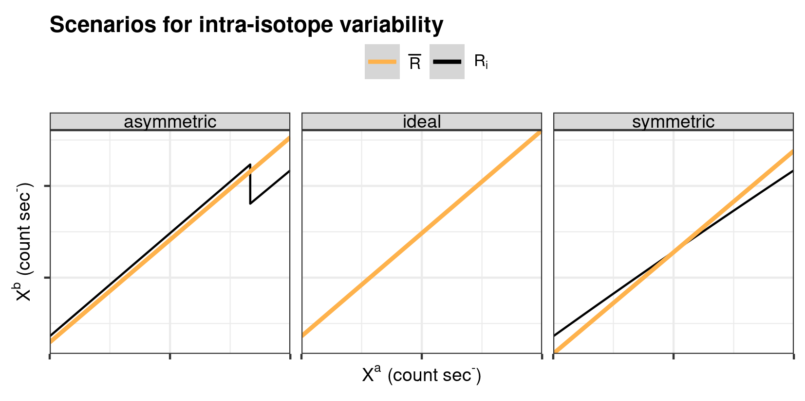

```{r, include = FALSE}
knitr::opts_chunk$set(
  collapse = TRUE,
  comment = "#>",
  eval = FALSE
)
```


The R package `pointapply` contains the code and data to reconstruct the publication: Martin Schobben, Michiel Kienhuis, and Lubos Polerecky. 2021. *New methods to detect isotopic heterogeneity with Secondary Ion Mass Spectrometry*, preprint on [Eartharxiv](https://eartharxiv.org/).


# Introduction 

This vignette shows how ion count data of a Secondary Ion Mass Spectrometry (SIMS) isotope analysis is simulated, which forms the basis to test the performance of th intra- and inter-analysis isotope test as introduced in the paper (Section 4.1 *Simulated data*). The accompanying vignette *Visualise test performance* (`vignette("performance")`) provides the code to plot the synthetic data produced here (Figs 4 and 5).

The following packages are used for the simulation.


```{r setup, eval=TRUE}
library(point) # regression diagnostics
library(pointapply) # load package
```


The performance of the intra- and inter-analysis isotope tests bundled in the `point` package are tested with the simulated (or synthetic) data.


# Simulate intra-analysis isotope variability data

The first simulation is designed to assess the sensitivity of the intra-analysis isotope variability test for two continuous variables; 1) ionization efficiency and, 2) the isotope offset between two components. The ionization efficiency is a systematic fluctuation in the emitted secondary ions, that should normally be mirrored in strength among both isotopes of the same element [@Fitzsimons2000a] (and see the paper). The ionization effect will have a bearing on the intra-analysis isotope variability test, as it is a regression-based method, where variance of the independent variable yields more precise estimation of the coefficients in the linear model. See the figure below to see how the difference in ionization efficiency affects how data points cluster, where a dense cluster signifies the absence of variability in in ionization efficiency and an elongated cluster with increased variance of ionization.


```{r estimates, echo=FALSE}
library(dplyr)
library(ggplot2)
library(scales)
library(ggrepel)

# stable ionization efficiency
stable_ion <- point::simu_R(0, "ideal", "13C", "12C", "VPDB", 1) %>% 
  mutate(type.nm = "stable ionization")
# fluctuating ionization efficiency
fluc_ion <- point::simu_R(10, "ideal", "13C", "12C", "VPDB", 1)  %>% 
  mutate(type.nm = "fluctuating ionization")
# combine
ion_eff <- bind_rows(stable_ion, fluc_ion)
# single ion stats
tb_X <- stat_X(
  ion_eff, 
  type.nm, 
  .X = Xt.sm, 
  .N = N.sm, 
  .stat = c("M", "S", "hat_S")
)

# stat ranges
mean_y <- filter(tb_X, species.nm == "13C")$M_Xt.sm %>% mean
x_fluc <- filter(fluc_ion, species.nm == "12C")$Xt.sm %>% range() %>% diff()
x_stable <- filter(stable_ion, species.nm == "12C")$Xt.sm %>% range() %>% diff() 
y_stable <- filter(stable_ion, species.nm == "13C")$Xt.sm %>% range() %>% diff() 
y_range <- c(
  mean_y - (x_fluc / x_stable * y_stable / 2),
  mean_y + (x_fluc / x_stable * y_stable / 2)
)

# plot
gg_dens(
  point::cov_R(ion_eff, c("12C", "13C"), type.nm), 
  x = Xt.sm.12C, 
  y = Xt.sm.13C, 
  xlab = expression(X^a~"(count sec"^"-"*")"), 
  ylab = expression(X^b~"(count sec"^"-"*")"), 
  ttl = "Excess ionization",
  y_lim = y_range,
  gr = type.nm,
  labels = "scientific"
) +
  geom_smooth(
    method = "lm", 
    formula = y ~ x - 1, 
    color = "black", 
    se = FALSE, 
    linetype = 2,
    size = 0.5,
    fullrange = TRUE
  ) +
  geom_errorbarh(
    data = filter(tb_X, species.nm == "12C"), 
    aes(xmin = M_Xt.sm - S_Xt.sm, xmax = M_Xt.sm + S_Xt.sm, y = 180),
    height = 20, 
    inherit.aes = FALSE
  ) +
  geom_errorbarh(
    data = filter(tb_X, species.nm == "12C"), 
    aes(xmin = M_Xt.sm - hat_S_N.sm, xmax = M_Xt.sm + hat_S_N.sm, y = 215),
    height = 20, 
    inherit.aes = FALSE
  ) +
  geom_text_repel(
    data = filter(tb_X, species.nm == "12C"), 
    aes(x = M_Xt.sm - S_Xt.sm, y = 180, label = "true"),
    nudge_x = -10,
    size = 3
  ) +
  geom_text_repel(
    data = filter(tb_X, species.nm == "12C"), 
    aes(x = M_Xt.sm - hat_S_N.sm, y = 215, label = "predicted"),
    nudge_x = -10,
    size = 3
  ) 

# save and print
save_point("ionization_concept", last_plot(), width = 15, height = 10, 
           unit = "cm")
```

```{r echo=FALSE, eval=TRUE, fig.cap="Conceptual sketches for ionization efficiency.", out.width="70%"}
   
```

In the above representation, the label "predicted" and "true" refer to a band of two times the predicted and descriptive standard deviation of $X^a$ around the mean, respectively. The difference in those two error bars during fluctuating ionization is referred to in the paper as "excess ionization".

The isotope offset encompasses two end-member components that cause intra-analysis isotope variability in the analysis, and this is one of the foremost targets in this study. Hence, a range of 22.0‰ is chosen to mimic the divergent isotope composition of carbonate and organic carbon inclusion hosted in a predominant carbonate matrix as a realistic scenario for a SIMS isotope analyses. Whereas, the range in ionization efficiency is varied from 0 to 120%, or 0 to 34% excess ionization. To exemplify this, the following figure shows a scenario of an organic component with a $\delta$^13^C of 32.0‰ in a predominant carbonate matrix with a $\delta$^13^C of 0‰.


```{r label, echo=FALSE}
library(purrr)

map2_dfr(
  c(4, 10), # seeds
  c(-32, 0), # anomalous R value
  ~simu_R(60, "asymmetric", "13C", "12C", "VPDB", .seed = .x, .devR = .y)
) |> 
  mutate(
    force.nm = if_else(force.nm == -32, "heterogeneity", "ideal")
  ) |>  
  diag_R("13C", "12C", force.nm, .plot = TRUE, .N = N.sm, .X = Xt.sm, 
         .plot_outlier_labs = c("organic", "carbonate")) 

p <- last_plot() + 
  themes_IC(base = theme_bw()) + 
  ggtitle("Bivariate isotopic heterogeneity")

# save and print
save_point("hetero_concept", p, width = 15, height = 10, 
           unit = "cm")
```


```{r echo=FALSE, eval=TRUE, fig.cap="Conceptual sketches for isotopic offset.", out.width="70%"}
   
```


## Parameters

For the sensitivity test (`test_sensitivity`), excess ionization and the isotopic offset are crossed for all possible combination with the `tidyr` [@tidyr] function `crossing()`. In addition, a 10 times repetition is included with a specified seed for each of the repetitions to ensure that the study is reproducible. 


```{r paramsintra}
# varying linear trends in the ionization efficiency (percent common isotope)
var_T <- seq(0, 120, length.out = 12)
# varying isotope offset (delta per mille)
var_I <- seq(0, -22, length.out = 12)
```


## Conceptual models of intra-analysis isotope variability

Besides the isotope-offset introduced above, two scenarios of intra-analysis isotope variability are tested (Supplementary Section 1.2: *Synthetic data* of the paper). The first scenario, referred to as *"asymmetric"* intra-analysis isotope variation, would approximate, for example, a situation in which the primary ion beams cuts through an organic inclusion (component A) with depth within a predominant carbonate matrix (component B), and thus both the matrix and isotopic composition deviate between components A and B. In a second scenario of *"symmetric"* intra-analysis isotope variation, a simulated gradient in the isotopic composition traverses the complete analyses.

```{r simulations, echo=FALSE}
# Compare input value of R with output (load dataset simu_IC)
tb_R <- stat_R(simu_IC, "13C", "12C", type.nm, trend.nm, base.nm, 
               force.nm, spot.nm, .output = "complete") 

# Re-calculate R from delta value with calib_R()
tb_R <- mutate(
  tb_R, 
  # main component
  base.nm = calib_R(base.nm, "VPDB", "13C", input = "delta", output = "R"),
  # R anomaly
  force.nm =
    if_else(
      type.nm == "ideal",
      base.nm,
      calib_R(force.nm, "VPDB", "13C", input = "delta", output = "R")
    )
) |> 
  group_by(type.nm, trend.nm, base.nm, force.nm) |> 
  mutate(threshold = 2 * sd(R_Xt.pr)) |> 
  filter(spot.nm == 1)

# breaks for x axis
brks <- with(
  filter(tb_R, type.nm == "ideal"), 
  c(min(M_R_Xt.pr - threshold), mean(M_R_Xt.pr), max(M_R_Xt.pr + threshold))
)

# Plot
ggplot(tb_R, aes(x = R_Xt.pr)) +
  geom_histogram(alpha = 0.4, binwidth = 1e-4) +
  geom_segment(
    aes(x = force.nm, xend = force.nm, y = 0, yend = 225), 
    linetype = 2, 
    color = "red"
  ) +
  geom_segment(
    aes(x = base.nm, xend = base.nm, y = 0, yend = 225), 
    linetype = 2
  ) +
  geom_hline(aes(yintercept = 0)) +
  geom_point(aes(x = M_R_Xt.pr, y = -15)) +
  geom_errorbarh(
    aes(
      xmin = M_R_Xt.pr - threshold, 
      xmax = M_R_Xt.pr + threshold, 
      y = -15
    ), 
    height = 10
  ) +
  scale_x_continuous(
    "R", 
    breaks = brks,
    labels = scales::label_scientific(2)
  ) +
  scale_y_continuous("count", expand = expansion(mult = c(.05, 0))) +
  facet_grid(cols = vars(type.nm)) +
  labs(title = "Univariate isotopic heterogeneity", subtitle = "") +
  themes_IC(base = theme_bw()) +
  theme(axis.text.x = element_text(angle = 45, vjust = 0.5))

# save and print
save_point("univariate_concept", last_plot(), width = 17, height = 6,
           unit = "cm")
```

```{r concept, echo=FALSE}
library(tidyr)

# ideal
Xt2 <- c(1.1e5, 1.3e5) # common
# start (ideal) R
R0 <- calib_R(0, "VPDB", "13C", input = "delta", output = "R")
# perturbation
R1 <- calib_R(-30, "VPDB", "13C", input = "delta", output = "R")
# linear R gradient
a_R <- ((R1 - R0) / (Xt2[2] - Xt2[1]))
b_R <- R0 - (a_R * Xt2[1])
# dataframe
tb_cp <- tibble(Xt2 = Xt2[1]:Xt2[2]) |> 
  mutate(
    ideal = Xt2 * R0,
    symmetric = (b_R + a_R * Xt2) * Xt2,
    asymmetric = approx(
      c(1, 5 * n() / 6, n()),
      c(R0, R1, R1),
      n = n(),
      method = "constant"
      )$y * Xt2
  ) |> 
  pivot_longer(-Xt2, values_to = "Xt1")

colors <- c("simulated Ri" = "black", "mean R" = "#FEB24C")

# plot
ggplot(tb_cp, aes(x = Xt2, y = Xt1, group = name, color = "simulated Ri")) +
  geom_point() +
  facet_grid(cols = vars(name)) + 
  geom_smooth(
    aes(color = "mean R", weight = 1 / Xt2), 
    method = "lm", 
    formula = y ~ x - 1
  ) +
  scale_y_continuous(
    expression(X^b~"(count sec"^"-"*")"), 
    expand = c(0, 0),
    breaks = scales::pretty_breaks(3),
    labels = NULL
  ) +
  scale_x_continuous(
    expression(X^a~"(count sec"^"-"*")"), 
    expand = c(0, 0),
    breaks = scales::pretty_breaks(2),
    labels = NULL
  ) +
  scale_color_manual(
    "", 
    values = colors, 
    labels = c(expression(R[i]), expression(bar(R)))
  ) +
  ggtitle("Scenarios for intra-analysis isotope variability") +
  themes_IC(base = theme_bw())

# save and print
save_point("simu_intra_concept", last_plot(), width = 15, height = 8,
           unit = "cm")
```


```{r echo=FALSE, eval=TRUE, fig.cap="Conceptual sketches for intra-analysis R variation.", out.width="70%"}
   
```


## Execute intra-analysis isotope variability simulation

The function `sensitivity_test` is especially designed to simulate SIMS isotope count data. The default arguments `.ion1 = "13C"`, `ion2  = "12C"` and `.reference = "VPDB"` define the isotope system and reference scale used to simulate the data. Together with the previous defined ranges for the sensitivity test (excess ionization and the isotopic offset) this produces the simulated data-set with intra-analysis isotope variability. The execution time of this function benefits from parallelization and the number of used workers can be set with the argument `mc_cores`. The generated data in the appropriate directory (`data` directory of the package).


```{r execintra}
# sensitivity
test_sensitivity(var_T, var_I, reps = 10, mc_cores = 4, save = TRUE)
```


# Sensitivity intra-analysis isotope variability test

The function `diag_R()` of the `point` package are the core functions for assessing intra-analysis isotope variability (as introduced in the paper). To gauge the performance of this test is analysed by applying the function to the synthetic data.

## Execute intra-analysis isotope variability test 
 
Two types of outlier detection are available; $\sigma_R$-rejection method (default method in the Cameca software) and the Cook's Distance measure (see paper for details).

### Cooks D

The Cook's D method is the default method of the `point` function `diag_R()`, and is therefore simple to execute.


```{r CD}
# performace Cooks D diagnostics
test_sensitivity(var_T, var_I, reps = 10, diag = "CooksD", mc_cores = 4, 
                 save = TRUE)
```


### Cameca

The $\sigma_R$-rejection method requires the `.method` of `diag_R()` to be set to `"Cameca"`. In addition, to faithfully mimic the behaviour of the Cameca software the grouping structure needs to be adjusted slightly, where this software uses an intermediate (but artificial) subdivision of a single analysis; the so-called "block" (variable: `bl.nm`), which consists generally of ~50 measurements. To accommodate this, the `diag_R()` and `eval_diag()` functions are successively applied with a respective grouping structure for "blocks" and then "single analysis". Note, that the `.output` of `diag_R()` is set to `"diagnostic"` to only produce outlier detection results. The application of `eval_diag()` produces now mean values for the single blocks, which are irrelevant for the subsequent study, as such the `tibble` [@tibble] is filtered for distinct analysis only by using `distinct()` [@dplyr]. This functionality has all been wrapped in the function `test_sensitivity`, which, furthermore, allows parallel execution (by setting `mc_cores` to an appropriate number) of this data intensive exercize.


```{r CM}
# performance Cameca diagnostics
test_sensitivity(var_T, var_I, reps = 10, diag = "Cameca", mc_cores = 4, 
                 save = TRUE)
```


# Simulate inter-analysis isotope variability data

The simulated data to assess the performance of the inter-analysis isotope variability test encompasses the same rang as for the intra-analysis isotope variability test. However, for this simulation, no intra-analysis isotope variance is included (instead the ideal linear R model is adopted), and only the starting value is varied over a range of 12.0‰ with again the VPDB isotope scale as a reference framework.

## parameters

The same procedure, but with a somewhat different parameter-set, is used to cross all possible combination with again 10 repetitions.


```{r paramsinter}
# varying linear trends in the ionization efficiency (percent common isotope)
var_T <- seq(0, 120, length.out = 12)
# varying isotope base (delta per mille)
var_B <- seq(0, -11, length.out = 12)
```


## Execute inter-analysis isotope simulation

Execution of the simulation (`test_sensitivity()`) for inter-analysis isotope data follows the same procedure as previously outlined for the intra-analysis isotope data simulation. 


## Post-simulation processing

The protocol for simulating the inter-analysis isotope dataset differs from the intra-analysis isotope variability protocol in that it includes a post-simulation processing step. Here, the $m$-series of analyses (a typical study along a transect) is recombined by randomly replacing one out of the 10 samples of the 0‰ (VPDB) set with an analysis that has an isotope value along the predefined range of -12--0‰. This replacement is repeated for each of the initial isotope values as defined in the starting parameters, and repeated 10 times, which produces 10 times 10-series of analyses with one anomalous isotope value, for each of the starting isotope values. This functionality is wrapped in `test_sensitivity()` , which again, directly writes the results to the correct directory.

# Sensitivity intra-analysis isotope variability test

The intra-analysis isotope variability test is also encapsulated in the sequential usage of `diag_R()` of the `point` package. However, for this sensitivity run the grouping is a little different as it has to point to the $m$-series of analyses, instead of single measurements (in the $n$-series of measurements. One note of caution, running this code requires a high workload from your computer.


```{r inter}
# performance inter-analysis diagnostics
test_sensitivity(var_T, var_B, reps = 10, mc_cores = 4, type = "inter", 
                 save = TRUE)
```


# References
